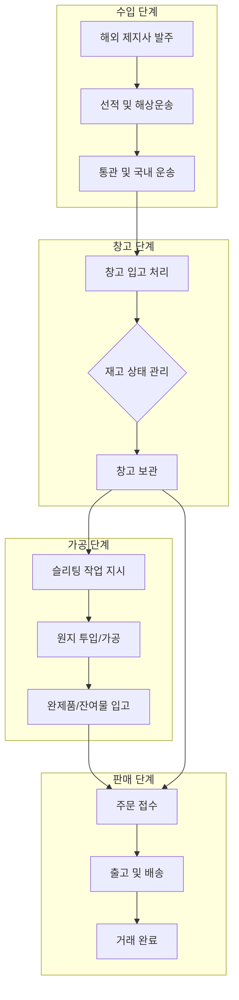

# 비즈니스 컨텍스트 (Business Context)

지산페이퍼(CHISAN Paper) 플랫폼의 비즈니스 배경과 목적, 도메인 용어 및 주요 워크플로우를 설명하는 문서입니다.

## 1. 기업 개요 (Company Overview)

**지산페이퍼(CHISAN Paper)**는 지류(Paper) 수입, 보관, 슬리팅(Slitting) 가공 및 유통을 전문으로 하는 중소기업입니다. 경기도 광주에 본사 및 주요 창고를 운영하고 있으며, 국내 인쇄소, 패키지 제조사, 특수 지류 가공업체 등에 고품질의 종이를 공급하고 있습니다.

주요 취급 품목은 다음과 같습니다.
*   **롤지 (Roll Paper)**: 매출의 약 80%를 차지하는 핵심 품목입니다. 해외 유수의 제지사(핀란드, 스웨덴, 미국 등)로부터 대량의 Parent Roll을 수입하여 보관하거나 고객이 원하는 규격으로 슬리팅 가공하여 공급합니다.
*   **평판지 (Sheet Paper)**: 매출의 약 20%를 차지합니다. 규격화된 사이즈로 재단된 종이로, 주로 상업 인쇄물 제작에 사용됩니다.

현재 6명의 소수 정예 내부 인력(경영, 수입/영업, 창고 관리, 생산 담당)으로 운영되고 있으나, 사업의 가파른 성장세에 힘입어 향후 2년 내 20명 이상의 규모로 조직을 확장을 계획하고 있습니다. 이러한 성장을 뒷받침하기 위해 기존의 파편화된 업무 프로세스를 통합하고 데이터의 정합성을 확보할 수 있는 전사적 플랫폼 구축이 시급한 상황입니다.

## 2. 비즈니스 도메인 상세 설명 (Business Domain Details)

지산페이퍼의 비즈니스는 크게 네 가지 핵심 도메인으로 나뉩니다.

### 2.1 수입 및 발주 (Import & Procurement)
지산페이퍼는 원자재의 대부분을 해외에서 조달합니다. 해외 제지사와의 직접 계약을 통해 발주를 진행하며, 이 과정에서 해상 운송 기간(Lead Time), 관세, 부가세, 물류비용 등 복잡한 수입 원가 계산이 수반됩니다. 시스템은 발주 시점부터 선적, 입항, 통관에 이르는 전 과정을 추적해야 합니다.

### 2.2 창고 및 재고 관리 (Inventory & Warehouse)
창고에 입고된 종이는 각각 고유한 ID(Batch No 또는 Roll ID)를 부여받아 관리됩니다. 종이는 온도와 습도에 민감한 제품이므로 적절한 위치(Location) 관리가 필수적이며, 선입선출(FIFO) 원칙에 따른 재고 회전이 중요합니다. 또한, 실시간 재고 파악을 통해 영업팀이 즉각적으로 납기를 확답할 수 있는 환경을 제공해야 합니다.

### 2.3 슬리팅 가공 (Production & Slitting)
지산페이퍼의 가장 큰 경쟁력은 자체 슬리팅 설비를 통한 맞춤형 가공입니다. 1,000mm 폭의 원지를 250mm 4개로 나누거나, 400mm 2개와 200mm 1개로 나누는 등 고객의 요구에 따라 다양하게 가공합니다. 이 과정에서 발생하는 'Loss(손실)'와 'Remnant(잔여 롤)'를 정확히 측정하고 시스템에 반영하는 것이 비즈니스의 핵심입니다.

### 2.4 유통 및 판매 (Distribution & Sales)
가공이 완료된 제품은 최종 고객사에게 배송됩니다. 다수의 거래처별로 다른 단가 정책, 결제 조건, 배송처 정보를 관리해야 하며, 출고 시 차량 배차 정보와 운송장 정보를 함께 기록하여 배송 추적성을 확보합니다.

## 3. 주요 페인 포인트 (Current Pain Points)

현재 시스템 부재로 인해 발생하는 구체적인 문제점들은 다음과 같습니다.

*   **재고 가시성 부족 (Lack of Inventory Visibility)**: 물리적 재고와 엑셀 장부의 일치율이 85% 수준에 머물러 있습니다. 이는 특히 슬리팅 가공 후 발생하는 잔여물(Remnant)이 즉각적으로 시스템에 반영되지 않아 발생하는 문제입니다.
*   **공정 추적성 결여 (Missing Traceability)**: 특정 제품에서 품질 문제가 발생했을 때, 이것이 어느 시점에 수입된 어떤 Parent Roll에서 파생되었는지 추적하는 데 며칠의 시간이 소요됩니다.
*   **복잡한 수입 원가 계산 (Manual Landing Cost Calculation)**: 해상 운임, 보험료, 관세 등을 포함한 최종 도착가(Landing Cost) 계산을 엑셀로 매번 수동 수행하므로 정확한 이익률 분석이 어렵습니다.
*   **커뮤니케이션 지연 (Communication Bottlenecks)**: 영업팀이 재고를 확인하기 위해 매번 창고 담당자에게 전화를 걸거나 직접 확인해야 하는 비효율이 발생합니다.
*   **인적 종속성 (Human Dependency)**: 특정 담당자만이 알고 있는 암묵지(제품 위치, 특수 가공 조건 등)가 많아 담당자 부재 시 업무가 마비되는 리스크가 있습니다.

## 4. 대상 사용자 및 역할 (Target Users & Roles)

시스템의 사용자는 권한에 따라 다음과 같이 구분됩니다.

| 역할 | 상세 설명 | 주요 책임 범위 |
| :--- | :--- | :--- |
| **시스템 관리자** | 플랫폼 전체 환경 설정 및 보안 관리 | 사용자 계정 관리, 시스템 로그 확인, 마스터 데이터 승인 |
| **구매/수입 담당** | 해외 소싱 및 수입 물류 관리 | 발주서 작성, 선적 스케줄 관리, 수입 비용 정산 |
| **영업 담당** | 고객 응대 및 수주 관리 | 견적서 발행, 주문 접수, 고객사 단가 관리, 납기 모니터링 |
| **창고 운영 담당** | 실물 재고의 입출고 및 보관 관리 | 바코드 스캔, 입출고 전표 작성, 위치 이동, 재고 실사 |
| **생산 지시/관리** | 슬리팅 설비 가공 계획 및 결과 관리 | 작업 지시서 생성, 투입량 대비 산출량 분석, 손실률 관리 |
| **경영진** | 전사 지표 확인 및 전략 수립 | 재고 회전율 분석, 매출/이익 통계, 사업 확장성 검토 |

## 5. 도메인 용어 사전 (Domain Glossary)

비즈니스 이해를 돕기 위한 전문 용어 설명입니다.

| 용어 (Korean) | 용어 (English) | 상세 설명 |
| :--- | :--- | :--- |
| **원지** | Parent Roll | 제지 공장에서 생산되어 수입된 거대 롤입니다. 모든 가공의 시작점입니다. |
| **슬리팅** | Slitting | 회전하는 칼날을 이용해 넓은 폭의 원지를 좁은 폭의 롤로 자르는 공정입니다. |
| **입고** | Stock-In | 외부 구매, 가공 결과물 또는 반품 등으로 인해 재고가 창고로 들어오는 행위입니다. |
| **출고** | Stock-Out | 판매, 가공 투입 또는 폐기 등을 위해 재고가 창고에서 나가는 행위입니다. |
| **발주** | Purchase Order | 공급업체에게 특정 품목과 수량을 주문하고 확약받는 문서화된 행위입니다. |
| **거래처** | Partner | 지산페이퍼와 상거래 관계에 있는 모든 공급업체(Supplier)와 고객사(Customer)입니다. |
| **평량** | Grammage | 종이의 기본 사양으로, 1제곱미터당 무게(g/㎡)를 의미합니다. 종이의 두께와 강도를 결정합니다. |
| **지폭** | Width | 롤 종이의 가로 너비(mm)입니다. 슬리팅의 기준이 되는 치수입니다. |
| **지름** | Diameter | 롤 제품의 외경(mm)입니다. 운송 및 설비 장착 시 중요한 제약 조건입니다. |
| **잔여물** | Remnant | 슬리팅 작업 후 남았지만 버리지 않고 재사용 가능한 수준의 롤입니다. |
| **지함** | Core | 종이가 감겨 있는 중심부의 종이 관입니다. 내경(Inner Diameter) 관리가 필요합니다. |
| **권취** | Winding | 종이를 롤 형태로 감는 행위 또는 그 상태를 의미합니다. |

## 6. 주요 워크플로우 상세 (Detailed Business Workflows)

### 6.1 수입 및 입고 프로세스
1.  **발주 결정**: 영업 수요와 현재 재고 수준을 분석하여 수입 품목 및 수량을 결정합니다.
2.  **PO 발행**: 시스템에서 Purchase Order를 생성하여 해외 제조사에 전달합니다.
3.  **선적 정보 업데이트**: 제조사로부터 받은 선적 서류(B/L, Invoice, Packing List) 정보를 시스템에 입력합니다.
4.  **창고 도착 및 검수**: 제품이 창고에 도착하면 실제 수량과 외관 상태를 확인합니다.
5.  **바코드 발행 및 부착**: 각 롤 단위로 고유 식별 바코드를 출력하여 부착합니다.
6.  **위치 지정 입고**: 지정된 랙(Rack) 위치에 제품을 적재하고 바코드를 스캔하여 입고 처리를 완료합니다.

### 6.2 슬리팅 가공 및 제품화 프로세스
1.  **가공 요청**: 고객사 주문 사양에 맞춰 슬리팅 작업 지시서를 생성합니다.
2.  **원지 선정**: 시스템에서 가용한 Parent Roll 중 유효기간이나 상태가 적절한 것을 선택(예약)합니다.
3.  **현장 투입**: 선택된 원지를 창고에서 불출(Stock-Out)하여 생산 라인으로 이동시킵니다.
4.  **가공 수행**: 작업자는 지시서에 명시된 지폭에 맞춰 칼날을 세팅하고 슬리팅을 진행합니다.
5.  **실적 기록**: 가공 완료 후 생산된 완제품 롤들의 개수, 총 중량, 잔여물 정보를 시스템에 입력합니다.
6.  **이력 자동 생성**: 시스템은 투입된 원지와 생산된 제품 간의 계보(Lineage)를 자동으로 생성합니다.

