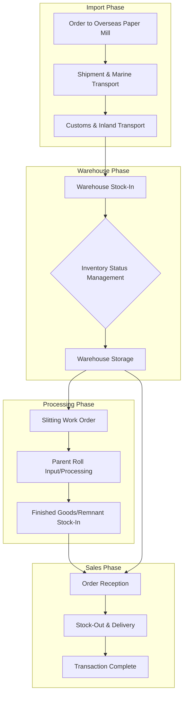

# Business Context

This document explains the business background, purpose, domain terms, and key workflows of the CHISAN Paper platform.

## 1. Company Overview

**CHISAN Paper** is an SME specializing in paper import, storage, slitting processing, and distribution. Headquartered in Gwangju, Gyeonggi-do, it operates major warehouses and supplies high-quality paper to domestic printing houses, package manufacturers, and special paper processors.

Key items handled are as follows:

- **Roll Paper**: A core item accounting for about 80% of sales. We import large quantities of Parent Rolls from leading overseas paper manufacturers (Finland, Sweden, USA, etc.) and store them or supply them after slitting processing to the specifications desired by the customer.
- **Sheet Paper**: Accounts for about 20% of sales. Paper cut to standardized sizes, mainly used for commercial printing production.

Currently, it is operated by a small elite internal staff of 6 (management, import/sales, warehouse management, production), but thanks to the rapid growth of the business, we plan to expand the organization to more than 20 people within the next 2 years. To support this growth, it is urgent to build a company-wide platform that can integrate existing fragmented work processes and ensure data integrity.

## 2. Business Domain Details

CHISAN Paper's business is divided into four key domains.

### 2.1 Import & Procurement

CHISAN Paper procures most of its raw materials from overseas. Orders are placed through direct contracts with overseas paper manufacturers, and this process involves complex import cost calculations such as marine transportation lead time, tariffs, VAT, and logistics costs. The system must track the entire process from order placement to shipment, arrival, and customs clearance.

### 2.2 Inventory & Warehouse

Paper stocked in the warehouse is managed by being assigned a unique ID (Batch No or Roll ID). Since paper is sensitive to temperature and humidity, proper location management is essential, and inventory turnover according to the First-In-First-Out (FIFO) principle is important. In addition, an environment must be provided where the sales team can immediately confirm delivery dates through real-time inventory identification.

### 2.3 Production & Slitting

CHISAN Paper's biggest competitiveness is custom processing through its own slitting facilities. We process variously according to customer needs, such as dividing a 1,000mm wide parent roll into four 250mm rolls, or two 400mm rolls and one 200mm roll. Accurately measuring 'Loss' and 'Remnant' occurring in this process and reflecting them in the system is the core of the business.

### 2.4 Distribution & Sales

Processed products are delivered to final customers. Different unit price policies, payment terms, and delivery address information must be managed for multiple partners, and vehicle allocation information and waybill information must be recorded together at the time of shipment to ensure delivery traceability.

## 3. Current Pain Points

Specific problems caused by the absence of the current system are as follows.

- **Lack of Inventory Visibility**: The match rate between physical inventory and Excel ledgers remains at around 85%. This is a problem that arises especially because Remnants generated after slitting processing are not immediately reflected in the system.
- **Missing Traceability**: When a quality problem occurs in a specific product, it takes days to trace which Parent Roll imported at what time it was derived from.
- **Manual Landing Cost Calculation**: Since the calculation of the final Landing Cost including ocean freight, insurance, and tariffs is performed manually in Excel every time, accurate profit margin analysis is difficult.
- **Communication Bottlenecks**: Inefficiencies occur where the sales team has to call the warehouse manager or check directly every time to check inventory.
- **Human Dependency**: There are many tacit knowledges (product location, special processing conditions, etc.) known only to specific managers, so there is a risk that work will be paralyzed in the absence of the manager.

## 4. Target Users & Roles

System users are classified as follows according to their authority.

| Role                        | Description                                                | Key Responsibilities                                                                     |
| :-------------------------- | :--------------------------------------------------------- | :--------------------------------------------------------------------------------------- |
| **System Admin**            | Platform environment configuration and security management | User account management, system log check, master data approval                          |
| **Purchase/Import Manager** | Overseas sourcing and import logistics management          | PO creation, shipment schedule management, import cost settlement                        |
| **Sales Manager**           | Customer response and order management                     | Quotation issuance, order reception, customer unit price management, delivery monitoring |
| **Warehouse Manager**       | Stock-in/out of physical inventory and storage management  | Barcode scan, stock-in/out slip creation, location movement, physical inventory          |
| **Production Manager**      | Slitting facility processing plan and result management    | Work order creation, input vs output analysis, loss rate management                      |
| **Executive**               | Company-wide indicator check and strategy establishment    | Inventory turnover analysis, sales/profit statistics, business scalability review        |

## 5. Domain Glossary

Explanation of technical terms to help understand the business.

| Term (Korean) | Term (English) | Description                                                                                                       |
| :------------ | :------------- | :---------------------------------------------------------------------------------------------------------------- |
| **원지**      | Parent Roll    | Huge rolls produced and imported from paper mills. The starting point of all processing.                          |
| **슬리팅**    | Slitting       | A process of cutting wide parent rolls into narrow rolls using rotating blades.                                   |
| **입고**      | Stock-In       | The act of inventory coming into the warehouse due to external purchase, processing results, or returns.          |
| **출고**      | Stock-Out      | The act of inventory leaving the warehouse for sales, processing input, or disposal.                              |
| **발주**      | Purchase Order | A documented act of ordering and confirming specific items and quantities from a supplier.                        |
| **거래처**    | Partner        | All Suppliers and Customers in a business relationship with CHISAN Paper.                                         |
| **평량**      | Grammage       | Basic specification of paper, meaning weight per square meter (g/㎡). Determines thickness and strength of paper. |
| **지폭**      | Width          | Horizontal width (mm) of roll paper. The standard dimension for slitting.                                         |
| **지름**      | Diameter       | Outer diameter (mm) of roll product. An important constraint during transportation and equipment mounting.        |
| **잔여물**    | Remnant        | Rolls that remain after slitting work but are reusable.                                                           |
| **지함**      | Core           | Paper tube in the center where paper is wound. Inner Diameter management is required.                             |
| **권취**      | Winding        | The act of winding paper into a roll shape or its state.                                                          |

## 6. Detailed Business Workflows

### 6.1 Import and Stock-In Process

1.  **Order Decision**: Analyze sales demand and current inventory levels to decide import items and quantities.
2.  **PO Issuance**: Create Purchase Order in the system and deliver it to the overseas manufacturer.
3.  **Shipment Information Update**: Enter shipping document (B/L, Invoice, Packing List) information received from the manufacturer into the system.
4.  **Warehouse Arrival and Inspection**: Check actual quantity and appearance condition when products arrive at the warehouse.
5.  **Barcode Issuance and Attachment**: Print and attach unique identification barcodes for each roll unit.
6.  **Location Designated Stock-In**: Load products in designated Rack locations and complete stock-in processing by scanning barcodes.

### 6.2 Slitting Processing and Productization Process

1.  **Processing Request**: Create slitting work order according to customer order specifications.
2.  **Parent Roll Selection**: Select (reserve) Parent Rolls with appropriate expiration dates or status among available ones in the system.
3.  **Field Input**: Stock-Out selected Parent Rolls from the warehouse and move them to the production line.
4.  **Processing Execution**: Operator sets blades according to width specified in work order and proceeds with slitting.
5.  **Performance Recording**: Enter number of finished rolls produced, total weight, and remnant information into the system after processing is completed.
6.  **History Auto-Generation**: System automatically generates lineage between input Parent Rolls and produced products.
