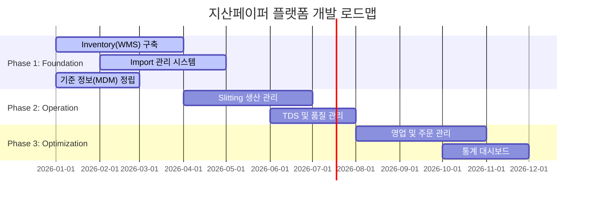

# 비전 및 범위 (Vision and Scope)

지산페이퍼(CHISAN Paper) 플랫폼 구축 프로젝트의 원대한 비전과 구체적인 개발 범위를 정의하는 문서입니다. 본 문서는 프로젝트의 나침반 역할을 하며, 개발 과정에서의 의사결정 기준이 됩니다.

## 1. 프로젝트 비전 (Project Vision)

> "지산페이퍼의 비즈니스 전 과정을 데이터로 통합하고, 슬리팅 가공 공정의 효율성을 극대화하여 종이 유통 산업의 디지털 전환(Digital Transformation)을 선도한다."

본 프로젝트는 단순히 종이 재고를 기록하는 시스템을 넘어, 수입부터 가공, 유통에 이르는 모든 Value Chain을 디지털화하여 **운영의 투명성**을 확보하고, **데이터 기반의 지능형 경영 체계**를 구축하는 것을 최종 목적으로 합니다. 모든 직원은 자신의 역할에 맞는 데이터를 실시간으로 조회하고, 시스템의 가이드를 통해 업무 실수를 최소화할 수 있습니다.

## 2. 비즈니스 목표 (Business Goals)

프로젝트의 목표는 시간 흐름에 따라 단계별로 설정됩니다.

### 단기 목표 (Short-term: 1~6개월)
*   **실시간 재고 정확도 99% 달성**: 전 제품 바코드 시스템 도입을 통해 물리적 재고와 시스템 재고의 오차를 1% 미만으로 관리합니다.
*   **수입/발주 관리 업무의 100% 디지털화**: 기존 수기 및 파편화된 파일로 관리되던 발주 정보를 시스템으로 통합하여 이력 추적성을 확보합니다.
*   **기초 데이터 표준화**: 거래처, 품목 규격(지폭, 평량, 지름 등), 창고 위치 정보의 표준화를 통해 데이터 기반 업무의 토대를 마련합니다.

### 중기 목표 (Mid-term: 6~18개월)
*   **슬리팅 공정 최적화 및 수율(Yield) 관리**: 가공 전후의 중량/길이 데이터를 정밀 추적하여 손실률을 분석하고, 공정 효율을 20% 이상 개선합니다.
*   **TDS(Technical Data Sheet) 자동화**: 제품별 기술 사양서를 시스템 내에서 즉시 생성하고, 고객사에게 PDF 형태로 즉시 발행하여 영업 대응 속도를 높입니다.
*   **업무 효율 50% 향상**: 중복 데이터 입력, 수동 엑셀 취합, 재고 확인을 위한 전화 커뮤니케이션을 자동화하여 핵심 업무에 집중할 수 있는 환경을 만듭니다.

### 장기 목표 (Long-term: 2년 이상)
*   **데이터 기반 수요 예측 및 발주 권고**: 과거 판매 데이터와 시장 트렌드를 분석하여 최적의 발주 시점과 물량을 제안함으로써 재고 비용을 최적화합니다.
*   **고객사 셀프 서비스 포털 구축**: 우수 고객사가 직접 재고 상태를 확인하고 온라인으로 주문 및 납기 확인을 할 수 있는 인터페이스를 제공합니다.
*   **지능형 물류 시스템 구축**: 창고 내 이동 동선 최적화 및 적재 위치 추천 알고리즘을 통해 물류 운영 비용을 최소화합니다.

## 3. 범위 정의 (Scope Definition)

### 개발 범위 포함 (IN)
시스템의 핵심 기능을 구성하는 모듈들입니다.

1.  **Inventory (WMS)**
    *   다중 창고(Main, Sub) 및 위치(Rack/Row) 관리.
    *   롤(Roll) 및 팔레트(Pallet) 단위 바코드 생성 및 스캔 처리.
    *   입출고, 재고 이동, 재고 실사, 조정 기능.
2.  **Import (Procurement)**
    *   해외 거래처 마스터 및 계약 정보 관리.
    *   Purchase Order(PO) 생성 및 선적서류(L/C, B/L 등) 추적.
    *   관세, 운임 정보를 포함한 수입 원가(Landing Cost) 계산 엔진.
3.  **Production (Slitting)**
    *   영업 주문 연동 작업 지시서(Work Order) 생성.
    *   투입 원지(Parent Roll) 대비 산출물(Finished Goods/Remnant) 매핑.
    *   공정별 작업 실적 및 설비 가동 시간 기록.
4.  **Partner & CRM**
    *   공급업체 및 고객사 통합 프로필 관리.
    *   거래처별 단가표 및 특수 계약 조건 관리.
5.  **TDS & Quality Control**
    *   제품별 기술 사양(Grammage, Thickness, Whiteness 등) 데이터베이스.
    *   검사 성적서 및 사양서 PDF 출력 기능.

### 개발 범위 제외 (OUT)
초기 단계에서는 구현하지 않거나 외부 연동으로 대체할 범위입니다.

*   **전문 회계 시스템 (ERP Accounting)**: 세무 신고, 복식 부기, 결산 기능은 전문 회계 소프트웨어와 데이터 연동으로 처리합니다.
*   **인사/급여 관리 (HRM/Payroll)**: 근태 관리 및 급여 계산은 별도 서비스를 이용하거나 수동 관리합니다.
*   **전자 계약 시스템**: 법적 효력을 갖는 전자 서명 및 계약 체결 프로세스는 초기 범위에서 제외합니다.
*   **자체 배송 관제 (TMS)**: 실시간 차량 GPS 추적 등 고도화된 배송 관제는 포함하지 않습니다.

## 4. 모듈 우선순위 및 개발 단계 (Project Phases)

비즈니스 가치 창출 속도를 극대화하기 위해 '진화적 개발(EvoDev)' 방식을 따릅니다.

| 단계 | 모듈 | 핵심 가치 | 우선순위 |
| :--- | :--- | :--- | :--- |
| **Phase 1 (Foundation)** | **Inventory & Core** | 재고 가시성 확보, 기준 정보 정립 | P0 (Highest) |
| **Phase 1 (Foundation)** | **Import** | 구매 이력 통합 및 수입 관리 자동화 | P0 (Highest) |
| **Phase 2 (Operation)** | **Production** | 슬리팅 가공 추적성 확보 및 수율 분석 | P1 (High) |
| **Phase 2 (Operation)** | **TDS** | 품질 데이터 자산화 및 영업 지원 | P2 (Medium) |
| **Phase 3 (Optimization)** | **Sales & Analytics** | 판매 전략 고도화 및 경영 지표 가시화 | P3 (Low) |

## 5. 성공 지표 (Key Success Metrics)

프로젝트 완료 후 다음과 같은 지표를 통해 성공 여부를 평가합니다.

1.  **재고 정확도 (Inventory Accuracy)**: 정기 실사 시 시스템 재고와 실물 재고의 일치율을 99.5% 이상으로 유지합니다.
2.  **데이터 조회 시간 (Lead Time for Info)**: 특정 제품의 수입 원가나 가공 이력을 조회하는 데 걸리는 시간을 기존 평균 30분에서 10초 이내로 단축합니다.
3.  **수작업 감소율 (Reduction in Manual Tasks)**: 엑셀 취합 및 중복 입력 업무 시간을 기존 대비 80% 이상 감소시킵니다.
4.  **시스템 활용률 (System Adoption)**: 모든 입출고 및 생산 실적 기록이 시스템을 통해 100% 처리됩니다.

## 6. 제약 사항 및 가정 (Constraints and Assumptions)

*   **기술적 제약**: 초기 구축 비용을 최소화하기 위해 Supabase와 Cloudflare R2 등 서버리스 인프라를 최대한 활용하며, 성능 병목 발생 시 유연하게 확장 가능한 아키텍처를 유지합니다.
*   **운영적 제약**: 현장 직원의 디지털 숙련도가 다양할 수 있으므로, 복잡한 기능보다는 직관적인 UI/UX와 모바일 친화적인 인터페이스를 최우선으로 고려합니다.
*   **데이터 가정**: 기존 엑셀 재고 데이터는 시스템 도입 시점에 맞춰 직원이 수동으로 정제하여 업로드하는 것을 원칙으로 합니다.
*   **네트워크 환경**: 창고 전 구역에 안정적인 Wi-Fi망이 구축되어 있다는 전제하에 실시간 데이터 처리를 설계합니다.

