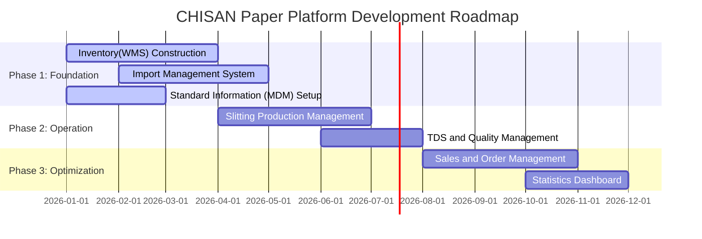

# Vision and Scope

This document defines the grand vision and specific development scope of the CHISAN Paper platform construction project. This document serves as a compass for the project and becomes a criterion for decision-making during the development process.

## 1. Project Vision

> "Integrate the entire business process of CHISAN Paper with data, maximize the efficiency of the slitting processing process, and lead the Digital Transformation of the paper distribution industry."

The final goal of this project is not just a system for recording paper inventory, but to digitalize the entire Value Chain from import to processing and distribution to secure **transparency of operations** and establish a **data-driven intelligent management system**. All employees can view data suitable for their roles in real time and minimize work errors through system guides.

## 2. Business Goals

Project goals are set in stages over time.

### Short-term Goals (1~6 months)

- **Achieve 99% Real-time Inventory Accuracy**: Manage the error between physical inventory and system inventory to less than 1% through the introduction of an all-product barcode system.
- **100% Digitalization of Import/Order Management Tasks**: Integrate order information managed by existing handwritten and fragmented files into the system to secure history traceability.
- **Standardization of Basic Data**: Establish the foundation for data-driven work through standardization of partner, item specifications (width, grammage, diameter, etc.), and warehouse location information.

### Mid-term Goals (6~18 months)

- **Optimization of Slitting Process and Yield Management**: Precisely track weight/length data before and after processing to analyze loss rates and improve process efficiency by more than 20%.
- **Automation of TDS (Technical Data Sheet)**: Instantly generate technical specification sheets for each product within the system and immediately issue them in PDF format to customers to increase sales response speed.
- **50% Improvement in Work Efficiency**: Create an environment where employees can focus on core tasks by automating duplicate data entry, manual Excel aggregation, and telephone communication for inventory checking.

### Long-term Goals (2 years+)

- **Data-driven Demand Forecasting and Order Recommendation**: Optimize inventory costs by suggesting optimal order timing and volume by analyzing past sales data and market trends.
- **Establishment of Customer Self-Service Portal**: Provide an interface where excellent customers can directly check inventory status and check orders and delivery dates online.
- **Establishment of Intelligent Logistics System**: Minimize logistics operating costs through optimization of movement paths in the warehouse and loading location recommendation algorithms.

## 3. Scope Definition

### In Scope

These are the modules that make up the core functions of the system.

1.  **Inventory (WMS)**
    - Management of multiple warehouses (Main, Sub) and locations (Rack/Row).
    - Barcode generation and scan processing for Roll and Pallet units.
    - Stock-in/out, inventory movement, physical inventory, adjustment functions.
2.  **Import (Procurement)**
    - Management of overseas partner master and contract information.
    - Purchase Order (PO) creation and shipping document (L/C, B/L, etc.) tracking.
    - Landing Cost calculation engine including tariffs and freight information.
3.  **Production (Slitting)**
    - Creation of Work Orders linked to sales orders.
    - Mapping of Input Parent Roll vs Output (Finished Goods/Remnant).
    - Recording of work performance by process and facility operation time.
4.  **Partner & CRM**
    - Integrated profile management for suppliers and customers.
    - Management of unit price tables and special contract conditions by partner.
5.  **TDS & Quality Control**
    - Database of technical specifications (Grammage, Thickness, Whiteness, etc.) by product.
    - Function to print inspection reports and specification sheets (PDF).

### Out of Scope

Scope that will not be implemented in the initial stage or will be replaced by external integration.

- **Professional Accounting System (ERP Accounting)**: Tax filing, double-entry bookkeeping, and settlement functions are handled by data integration with professional accounting software.
- **HRM/Payroll**: Attendance management and payroll calculation are handled by separate services or manually.
- **Electronic Contract System**: Electronic signature and contract conclusion processes with legal effect are excluded from the initial scope.
- **Own Delivery Control (TMS)**: Advanced delivery control such as real-time vehicle GPS tracking is not included.

## 4. Module Priorities and Development Phases

We follow the 'Evolutionary Development (EvoDev)' method to maximize the speed of business value creation.

| Phase                      | Module                | Core Value                                                                 | Priority     |
| :------------------------- | :-------------------- | :------------------------------------------------------------------------- | :----------- |
| **Phase 1 (Foundation)**   | **Inventory & Core**  | Securing inventory visibility, establishing standard information           | P0 (Highest) |
| **Phase 1 (Foundation)**   | **Import**            | Integration of purchase history and automation of import management        | P0 (Highest) |
| **Phase 2 (Operation)**    | **Production**        | Securing traceability of slitting processing and yield analysis            | P1 (High)    |
| **Phase 2 (Operation)**    | **TDS**               | Assetization of quality data and sales support                             | P2 (Medium)  |
| **Phase 3 (Optimization)** | **Sales & Analytics** | Advancement of sales strategies and visualization of management indicators | P3 (Low)     |

## 5. Key Success Metrics

After project completion, success is evaluated through the following metrics.

1.  **Inventory Accuracy**: Maintain the match rate between system inventory and physical inventory at 99.5% or higher during regular physical inventory.
2.  **Lead Time for Info**: Shorten the time it takes to inquire about import costs or processing history of a specific product from an average of 30 minutes to within 10 seconds.
3.  **Reduction in Manual Tasks**: Reduce Excel aggregation and duplicate entry work time by more than 80% compared to existing levels.
4.  **System Adoption**: 100% of all stock-in/out and production performance records are processed through the system.

## 6. Constraints and Assumptions

- **Technical Constraints**: To minimize initial setup costs, we utilize serverless infrastructure such as Supabase and Cloudflare R2 as much as possible, and maintain an architecture that can be flexibly expanded when performance bottlenecks occur.
- **Operational Constraints**: Since the digital proficiency of field staff may vary, UI/UX that is intuitive and mobile-friendly interfaces are considered top priority rather than complex functions.
- **Data Assumptions**: In principle, existing Excel inventory data should be manually refined and uploaded by employees at the time of system introduction.
- **Network Environment**: Real-time data processing is designed on the premise that a stable Wi-Fi network is established in all areas of the warehouse.
