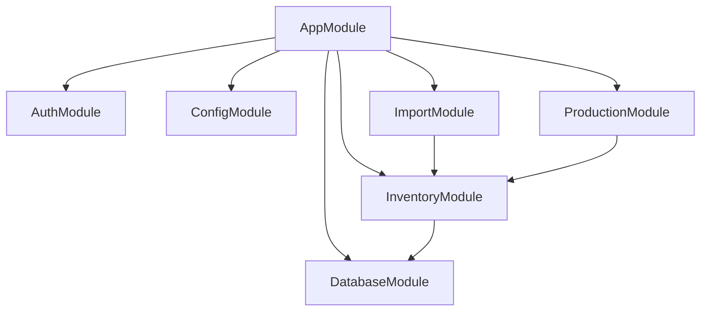

# 백엔드 아키텍처 (Backend Architecture)

CHISAN Platform의 백엔드는 NestJS 프레임워크를 기반으로 하며, 견고하고 확장 가능한 모듈형 아키텍처를 지향합니다.

## 1. 모듈 구조 (Module Structure)

백엔드는 기능별로 분리된 모듈 구조를 가집니다. 각 모듈은 독립적인 도메인 로직을 캡슐화합니다.



## 2. 핵심 모듈 설계 (Core Module Design)

-   **DatabaseModule**: Prisma 또는 Kysely를 사용하여 PostgreSQL(Supabase)과의 연결을 관리합니다. 전역 모듈로 선언되어 다른 모든 모듈에서 접근 가능합니다.
-   **AuthModule**: Supabase Auth와 연동하여 JWT를 검증하고, 요청 객체에 유저 정보를 주입하는 Guard와 Decorator를 제공합니다.
-   **ConfigModule**: `@nestjs/config`를 사용하여 환경 변수를 타입 세이프하게 관리합니다.

## 3. 기능 모듈 패턴 (Feature Module Pattern)

각 기능 모듈(예: Inventory)은 다음과 같은 일관된 레이어 구조를 따릅니다.

1.  **Controller**: HTTP 엔드포인트를 정의하고 요청을 수신합니다.
2.  **Service**: 비즈니스 로직을 수행하고 트랜잭션을 관리합니다.
3.  **Repository**: 데이터베이스 접근 로직을 추상화합니다. (선택 사항, 필요 시 Service에 통합)
4.  **DTO (Data Transfer Object)**: 계층 간 데이터 전달 형식을 정의합니다.

## 4. Zod를 이용한 DTO 검증 (DTO Validation with Zod)

`packages/shared`에 정의된 Zod 스키마를 활용하여 요청 데이터를 검증합니다. NestJS의 `ValidationPipe` 대신 커스텀 `ZodValidationPipe`를 사용합니다.

### 예시 코드 (Schema & Pipe)

```typescript
// packages/shared/src/schemas/inventory.schema.ts
import { z } from 'zod';

export const CreateStockInSchema = z.object({
  itemCode: z.string().min(1),
  quantity: z.number().positive(),
  warehouseId: z.string().uuid(),
});

export type CreateStockInDto = z.infer<typeof CreateStockInSchema>;

// apps/api/src/common/pipes/zod-validation.pipe.ts
import { PipeTransform, ArgumentMetadata, BadRequestException } from '@nestjs/common';
import { ZodSchema } from 'zod';

export class ZodValidationPipe implements PipeTransform {
  constructor(private schema: ZodSchema) {}

  transform(value: unknown, metadata: ArgumentMetadata) {
    try {
      const parsedValue = this.schema.parse(value);
      return parsedValue;
    } catch (error) {
      throw new BadRequestException('Validation failed');
    }
  }
}
```

## 5. 에러 처리 전략 (Error Handling Strategy)

-   **Global Exception Filter**: 모든 예외를 캡치하여 일관된 에러 응답 포맷을 보장합니다.
-   **Domain Exceptions**: 비즈니스 로직 내에서 발생하는 특정 상황에 대해 커스텀 예외 클래스(예: `InsufficientStockException`)를 사용합니다.

```json
{
  "success": false,
  "error": {
    "code": "INSUFFICIENT_STOCK",
    "message": "재고가 부족합니다.",
    "details": { "available": 10, "requested": 15 }
  }
}
```

## 6. API 버전 관리 전략 (API Versioning)

URI 기반 버전 관리를 사용합니다 (예: `/api/v1/...`).

```typescript
// apps/api/src/main.ts
app.enableVersioning({
  type: VersioningType.URI,
  defaultVersion: '1',
});
```

## 7. 테스트 전략 (Testing Strategy)

1.  **Unit Tests**: 개별 Service 로직을 Vitest를 사용하여 테스트합니다. 의존성은 Mocking합니다.
2.  **Integration Tests**: Controller와 Database 간의 연동을 테스트합니다. 실제 또는 테스트용 DB를 사용합니다.
3.  **E2E Tests**: 실제 HTTP 요청을 보내어 전체 흐름을 검증합니다.

### 예시 테스트 코드

```typescript
describe('InventoryService', () => {
  it('should increase stock when stock-in is processed', async () => {
    const result = await service.processStockIn({
      itemCode: 'ROLL-001',
      quantity: 100,
    });
    expect(result.currentStock).toBe(100);
  });
});
```

## 8. 모듈별 책임 분리 (Separation of Concerns)

-   **Controller**: 파라미터 추출, 권한 확인(Guard), DTO 검증(Pipe).
-   **Service**: 비즈니스 규칙 적용, 트랜잭션 경계 설정, 다른 모듈 서비스 호출.
-   **Shared**: 타입 정의, 유효성 검사 규칙, 공통 유틸리티.

## 9. 로깅 및 모니터링 (Logging & Monitoring)

-   NestJS Built-in Logger를 사용하되, 운영 환경에서는 Pino 또는 Winston을 사용하여 구조화된 로그(JSON)를 생성합니다.
-   중요한 비즈니스 이벤트(예: 대량 출고)는 감사 로그(Audit Log)로 기록합니다.
