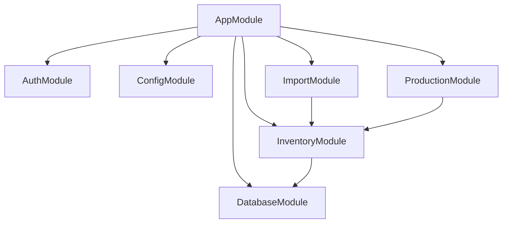

# Backend Architecture

The backend of CHISAN Platform is based on NestJS framework and aims for a robust and scalable modular architecture.

## 1. Module Structure

The backend has a module structure separated by function. Each module encapsulates independent domain logic.



## 2. Core Module Design

- **DatabaseModule**: Manages connection with PostgreSQL (Supabase) using Prisma or Kysely. Declared as a global module and accessible from all other modules.
- **AuthModule**: Integrates with Supabase Auth to validate JWT and provides Guards and Decorators that inject user information into the request object.
- **ConfigModule**: Manages environment variables in a type-safe way using `@nestjs/config`.

## 3. Feature Module Pattern

Each feature module (e.g., Inventory) follows a consistent layer structure:

1.  **Controller**: Defines HTTP endpoints and receives requests.
2.  **Service**: Performs business logic and manages transactions.
3.  **Repository**: Abstracts database access logic. (Optional, integrated into Service if needed)
4.  **DTO (Data Transfer Object)**: Defines data transfer formats between layers.

## 4. DTO Validation with Zod

Utilize Zod schemas defined in `packages/shared` to validate request data. Use custom `ZodValidationPipe` instead of NestJS's `ValidationPipe`.

### Example Code (Schema & Pipe)

```typescript
// packages/shared/src/schemas/inventory.schema.ts
import { z } from "zod";

export const CreateStockInSchema = z.object({
  itemCode: z.string().min(1),
  quantity: z.number().positive(),
  warehouseId: z.string().uuid(),
});

export type CreateStockInDto = z.infer<typeof CreateStockInSchema>;

// apps/api/src/common/pipes/zod-validation.pipe.ts
import {
  PipeTransform,
  ArgumentMetadata,
  BadRequestException,
} from "@nestjs/common";
import { ZodSchema } from "zod";

export class ZodValidationPipe implements PipeTransform {
  constructor(private schema: ZodSchema) {}

  transform(value: unknown, metadata: ArgumentMetadata) {
    try {
      const parsedValue = this.schema.parse(value);
      return parsedValue;
    } catch (error) {
      throw new BadRequestException("Validation failed");
    }
  }
}
```

## 5. Error Handling Strategy

- **Global Exception Filter**: Catch all exceptions to guarantee a consistent error response format.
- **Domain Exceptions**: Use custom exception classes (e.g., `InsufficientStockException`) for specific situations occurring within business logic.

```json
{
  "success": false,
  "error": {
    "code": "INSUFFICIENT_STOCK",
    "message": "Stock is insufficient.",
    "details": { "available": 10, "requested": 15 }
  }
}
```

## 6. API Versioning Strategy

Use URI-based version management (e.g., `/api/v1/...`).

```typescript
// apps/api/src/main.ts
app.enableVersioning({
  type: VersioningType.URI,
  defaultVersion: "1",
});
```

## 7. Testing Strategy

1.  **Unit Tests**: Test individual Service logic using Vitest. Dependencies are Mocked.
2.  **Integration Tests**: Test integration between Controller and Database. Use actual or test DB.
3.  **E2E Tests**: Send actual HTTP requests to verify the entire flow.

### Example Test Code

```typescript
describe("InventoryService", () => {
  it("should increase stock when stock-in is processed", async () => {
    const result = await service.processStockIn({
      itemCode: "ROLL-001",
      quantity: 100,
    });
    expect(result.currentStock).toBe(100);
  });
});
```

## 8. Separation of Concerns by Module

- **Controller**: Parameter extraction, permission check (Guard), DTO validation (Pipe).
- **Service**: Apply business rules, set transaction boundaries, call other module services.
- **Shared**: Type definitions, validation rules, common utilities.

## 9. Logging & Monitoring

- Use NestJS Built-in Logger, but use Pino or Winston in production environment to generate structured logs (JSON).
- Important business events (e.g., bulk stock-out) are recorded as Audit Logs.
