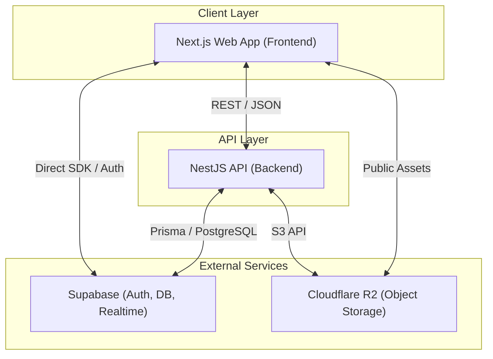

# 아키텍처 개요 (Architecture Overview)

CHISAN Platform은 지산페이퍼의 비즈니스 복잡성을 수용하고 향후 확장성을 보장하기 위해 설계된 현대적인 하이브리드 아키텍처를 채택합니다.

## 1. 하이레벨 시스템 다이어그램 (High-level System Diagram)

시스템의 전체적인 구성과 구성 요소 간의 관계를 나타냅니다.



## 2. 하이브리드 아키텍처 설명 (Hybrid Architecture)

CHISAN Platform은 **"Hybrid Architecture"** 전략을 사용합니다. 이는 다음 두 가지 접근 방식을 결합한 것을 의미합니다.

1.  **BFF (Backend For Frontend) Pattern**: Next.js App Router를 사용하여 서버 사이드 렌더링(SSR)과 데이터 페칭을 최적화합니다. 복잡한 UI 로직과 초기 진입 속도를 관리합니다.
2.  **Robust Core Backend**: 비즈니스 로직의 중심(NestJS)을 별도로 두어 데이터 무결성, 복잡한 트랜잭션, 외부 시스템 연동을 처리합니다.
3.  **Direct Database Access (Edge Cases)**: 간단한 읽기 작업이나 실시간 업데이트가 필요한 경우 Supabase SDK를 통해 클라이언트에서 직접 데이터베이스(RLS 적용)에 접근하여 개발 속도를 높입니다.

## 3. 통신 패턴 (Communication Patterns)

-   **REST API**: Backend(NestJS)와 Frontend(Next.js) 간의 주요 통신 방식으로 사용됩니다. OpenAPI(Swagger)를 통해 명세화됩니다.
-   **Shared Schemas**: `packages/shared` 모듈에 정의된 Zod 스키마를 통해 API 요청/응답의 타입을 컴파일 타임과 런타임 모두에서 보장합니다.
-   **Realtime**: 재고 상태 변화나 작업 지시 알림 등을 위해 Supabase Realtime(WebSockets)을 활용합니다.

## 4. 데이터 흐름 개요 (Data Flow Overview)

### 4.1 읽기 흐름 (Read Flow)
1.  사용자가 웹 페이지 접근.
2.  Next.js Server Component가 필요에 따라 Backend API 호출 또는 Supabase 직접 조회.
3.  데이터를 가공하여 HTML로 렌더링 후 클라이언트에 전달.
4.  클라이언트 사이드에서 추가적인 인터랙션 발생 시 클라이언트 SDK로 데이터 페칭.

### 4.2 쓰기 흐름 (Write Flow)
1.  사용자가 폼 제출.
2.  Next.js Client Component가 Backend API로 요청 전달.
3.  Backend(NestJS)는 `shared` 스키마로 유효성 검사 수행.
4.  복잡한 비즈니스 로직(예: 재고 차감, 이력 생성) 처리 후 데이터베이스 반영.
5.  성공 응답 반환 및 UI 업데이트.

## 5. 보안 아키텍처 (Security Architecture)

-   **인증 (Authentication)**: Supabase Auth를 사용하여 OAuth2 및 이메일/비밀번호 인증을 처리합니다. JWT 기반의 세션 관리를 수행합니다.
-   **인가 (Authorization)**:
    -   **Backend**: NestJS의 Guard를 사용하여 JWT 유효성을 검사하고 역할 기반 접근 제어(RBAC)를 수행합니다.
    -   **Database**: Supabase의 Row Level Security(RLS)를 적용하여 잘못된 데이터 접근을 물리적으로 차단합니다.
-   **인프라 보안**: API Key 및 시크릿은 환경 변수로 관리하며, Cloudflare를 통해 DDoS 방어 및 SSL/TLS 암호화를 적용합니다.

## 6. 배포 아키텍처 (Deployment Architecture)

시스템은 모노레포 구조로 관리되며, 다음과 같이 배포됩니다.

-   **Monorepo**: Turbo (Turborepo)를 사용하여 빌드 파이프라인 최적화 및 원격 캐싱을 통한 CI/CD 속도 향상.
-   **Frontend**: Vercel 또는 유사한 Edge Platform에 배포하여 글로벌 성능 최적화 및 자동 프리뷰 기능 활용.
-   **Backend**: Docker Container로 패키징되어 클라우드 서비스(AWS ECS, GCP Cloud Run 등)에 배포되어 오토스케일링 지원.
-   **Database/Storage**: Supabase Managed Service 및 Cloudflare R2 사용으로 인프라 관리 부담 최소화.

## 7. Cloudflare R2 활용 전략 (Object Storage)

CHISAN Platform은 비정형 데이터(이미지, PDF, 바코드 파일 등)를 저장하기 위해 Cloudflare R2를 사용합니다.

-   **Egress Fee Zero**: 데이터 다운로드 시 발생하는 전송 비용이 없어 운영 비용을 획기적으로 절감합니다.
-   **S3 Compatibility**: 표준 S3 API를 지원하여 기존 라이브러리 및 도구를 그대로 활용 가능합니다.
-   **Signed URLs**: 보안이 필요한 문서(TDS 등)는 기간 한정 서명된 URL을 통해 안전하게 공유합니다.

## 8. 모노레포 도입의 이점 (Monorepo Benefits)

1.  **Code Sharing**: `packages/shared`를 통해 백엔드와 프런트엔드 간의 타입을 100% 공유하여 타입 불일치로 인한 런타임 에러를 방지합니다.
2.  **Unified Workflow**: 모든 프로젝트의 빌드, 테스트, 린트 설정을 중앙에서 관리하여 개발 생산성을 높입니다.
3.  **Atomic Commits**: 여러 앱이나 패키지에 걸친 변경 사항을 하나의 커밋으로 관리하여 의존성 관리를 단순화합니다.

## 9. 향후 확장 계획 (Future Scalability)

-   **tRPC 도입**: 더욱 강력한 타입 안전성을 위해 REST API 외에 tRPC 도입을 고려하고 있습니다.
-   **Microservices**: 비즈니스가 거대해질 경우 특정 모듈(예: 정교한 생산 알고리즘)을 별도의 마이크로서비스로 분리할 수 있는 구조를 유지합니다.
-   **Edge Computing**: 지연 시간에 민감한 작업은 Cloudflare Workers를 통해 엣지에서 처리하도록 확장 가능합니다.

---

## 10. 모노레포 구조 (Monorepo Structure)

```text
chisan-platform/
├── apps/
│   ├── api/          # NestJS backend (Core Logic)
│   └── web/          # Next.js frontend (UI/BFF)
├── packages/
│   └── shared/       # Shared types, validators, utilities
├── docs/             # Technical & Business Documentation
├── .github/          # CI/CD Workflows
└── turbo.json        # Turborepo configuration
```
