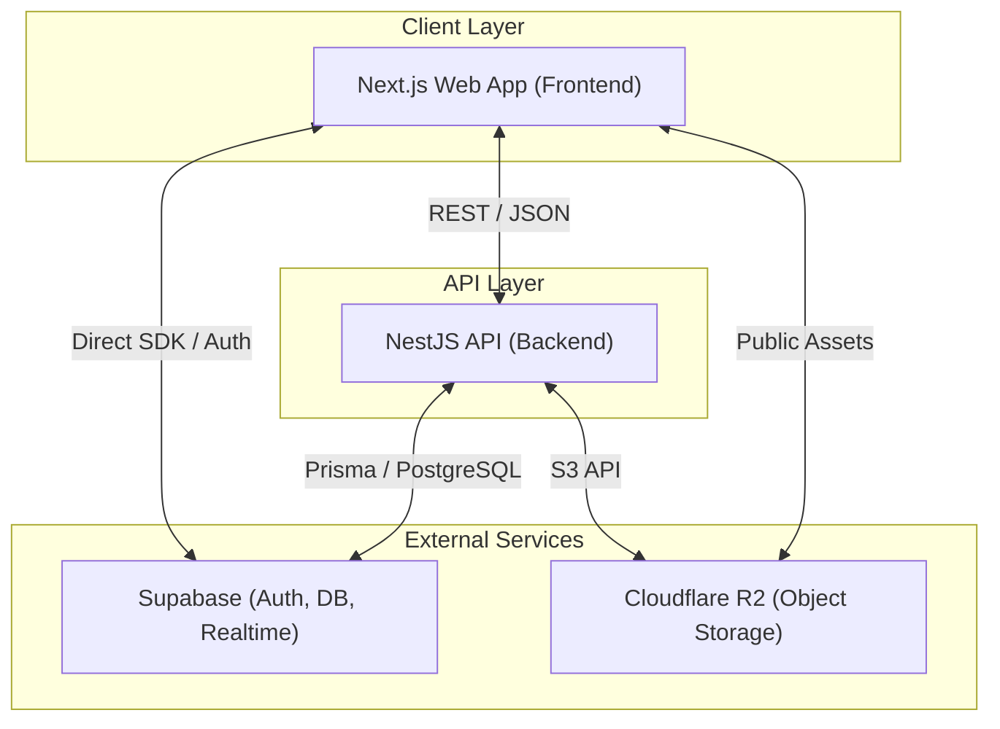

# Architecture Overview

CHISAN Platform adopts a modern hybrid architecture designed to accommodate the business complexity of CHISAN Paper and ensure future scalability.

## 1. High-level System Diagram

Shows the overall composition of the system and the relationships between components.



## 2. Hybrid Architecture Description

CHISAN Platform uses a **"Hybrid Architecture"** strategy. This implies combining the following two approaches:

1.  **BFF (Backend For Frontend) Pattern**: Uses Next.js App Router to optimize Server-Side Rendering (SSR) and data fetching. Manages complex UI logic and initial entry speed.
2.  **Robust Core Backend**: Maintains a separate center of business logic (NestJS) to handle data integrity, complex transactions, and external system integrations.
3.  **Direct Database Access (Edge Cases)**: For simple read operations or when real-time updates are needed, accessing the database directly from the client via Supabase SDK (with RLS applied) increases development speed.

## 3. Communication Patterns

- **REST API**: Used as the main communication method between Backend (NestJS) and Frontend (Next.js). Specification is done via OpenAPI (Swagger).
- **Shared Schemas**: Zod schemas defined in `packages/shared` module guarantee the types of API requests/responses at both compile time and runtime.
- **Realtime**: Utilizes Supabase Realtime (WebSockets) for inventory status changes or work order notifications.

## 4. Data Flow Overview

### 4.1 Read Flow

1.  User accesses web page.
2.  Next.js Server Component calls Backend API or queries Supabase directly as needed.
3.  Process data, render to HTML, and deliver to client.
4.  Fetch data with client SDK when additional interaction occurs on client side.

### 4.2 Write Flow

1.  User submits form.
2.  Next.js Client Component forwards request to Backend API.
3.  Backend (NestJS) performs validation with `shared` schema.
4.  Process complex business logic (e.g., inventory deduction, history creation) and reflect in database.
5.  Return success response and update UI.

## 5. Security Architecture

- **Authentication**: Handles OAuth2 and email/password authentication using Supabase Auth. Performs JWT-based session management.
- **Authorization**:
  - **Backend**: Uses NestJS Guard to validate JWT and perform Role-Based Access Control (RBAC).
  - **Database**: Applies Supabase's Row Level Security (RLS) to physically block invalid data access.
- **Infrastructure Security**: API Keys and secrets are managed as environment variables, and DDoS protection and SSL/TLS encryption are applied via Cloudflare.

## 6. Deployment Architecture

The system is managed as a monorepo structure and deployed as follows:

- **Monorepo**: Uses Turbo (Turborepo) for build pipeline optimization and CI/CD speed improvement through remote caching.
- **Frontend**: Deployed to Vercel or similar Edge Platform for global performance optimization and utilization of automatic preview features.
- **Backend**: Packaged as Docker Container and deployed to cloud services (AWS ECS, GCP Cloud Run, etc.) to support auto-scaling.
- **Database/Storage**: Minimizes infrastructure management burden by using Supabase Managed Service and Cloudflare R2.

## 7. Cloudflare R2 Utilization Strategy (Object Storage)

CHISAN Platform uses Cloudflare R2 to store unstructured data (images, PDFs, barcode files, etc.).

- **Egress Fee Zero**: Drastically reduces operating costs as there are no transfer costs when downloading data.
- **S3 Compatibility**: Supports standard S3 API, allowing existing libraries and tools to be used as is.
- **Signed URLs**: Securely shares documents requiring security (TDS, etc.) through time-limited signed URLs.

## 8. Monorepo Benefits

1.  **Code Sharing**: Prevents runtime errors due to type mismatches by 100% sharing types between backend and frontend via `packages/shared`.
2.  **Unified Workflow**: Increases development productivity by centrally managing build, test, and lint settings for all projects.
3.  **Atomic Commits**: Simplifies dependency management by managing changes across multiple apps or packages in a single commit.

## 9. Future Scalability

- **tRPC Introduction**: We are considering introducing tRPC in addition to REST API for stronger type safety.
- **Microservices**: Maintains a structure where specific modules (e.g., sophisticated production algorithms) can be separated into separate microservices if the business becomes huge.
- **Edge Computing**: Latency-sensitive tasks can be expanded to be processed at the edge via Cloudflare Workers.

---

## 10. Monorepo Structure

```text
chisan-platform/
├── apps/
│   ├── api/          # NestJS backend (Core Logic)
│   └── web/          # Next.js frontend (UI/BFF)
├── packages/
│   └── shared/       # Shared types, validators, utilities
├── docs/             # Technical & Business Documentation
├── .github/          # CI/CD Workflows
└── turbo.json        # Turborepo configuration
```
