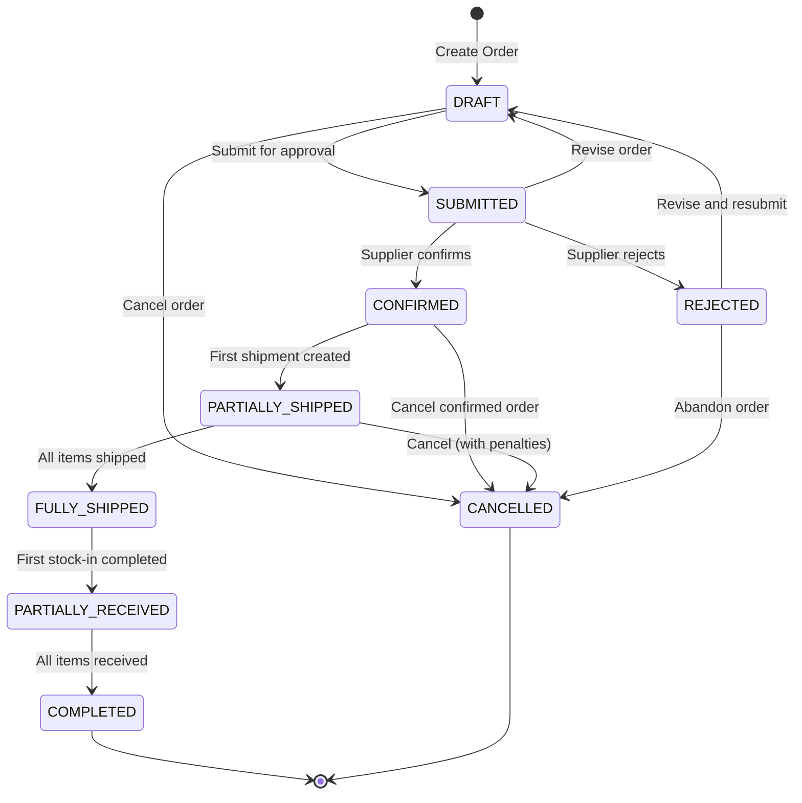
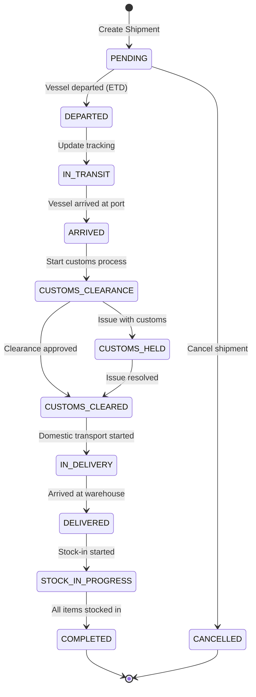
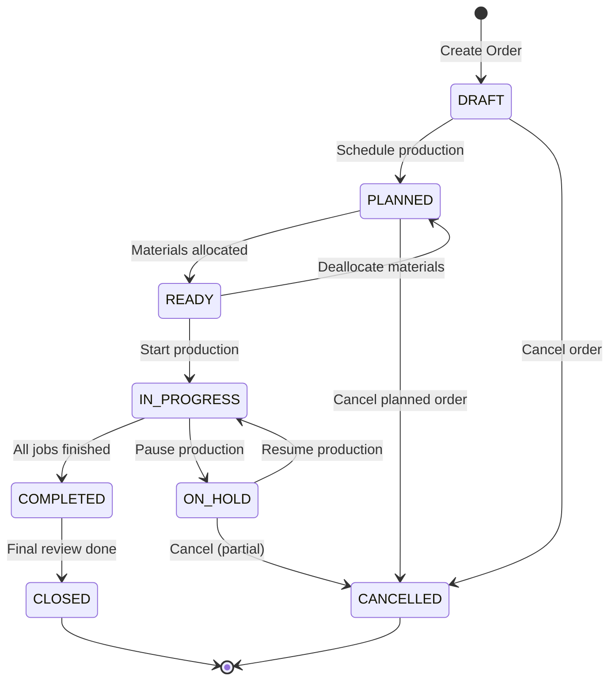
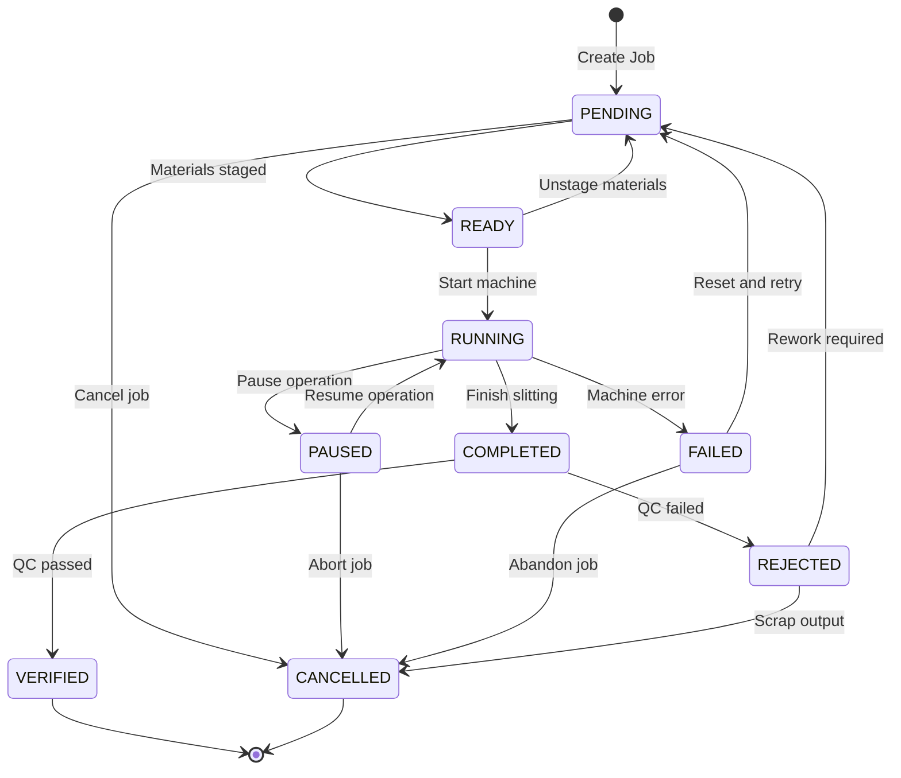
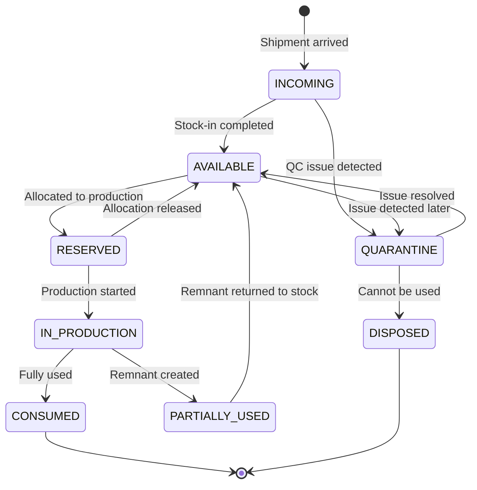
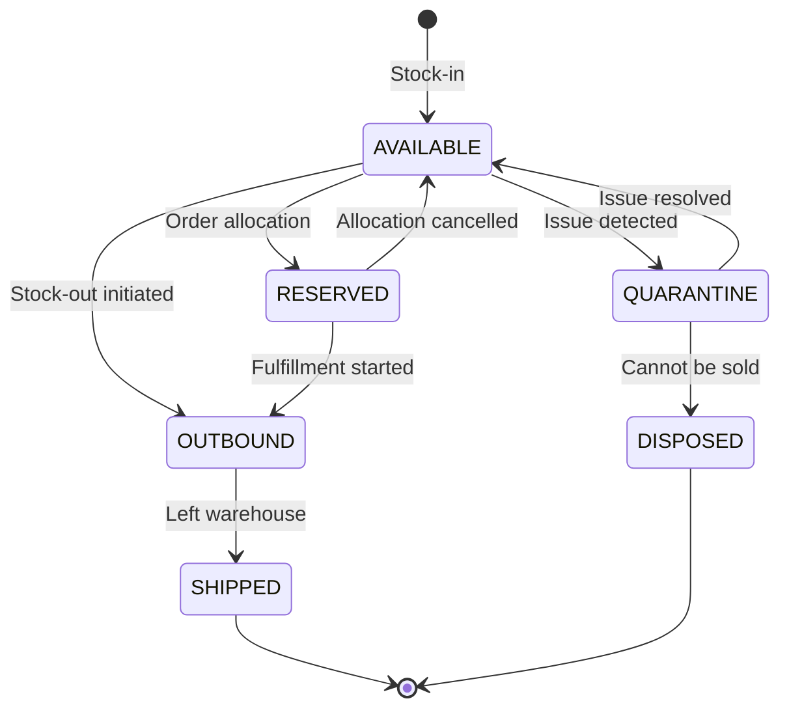
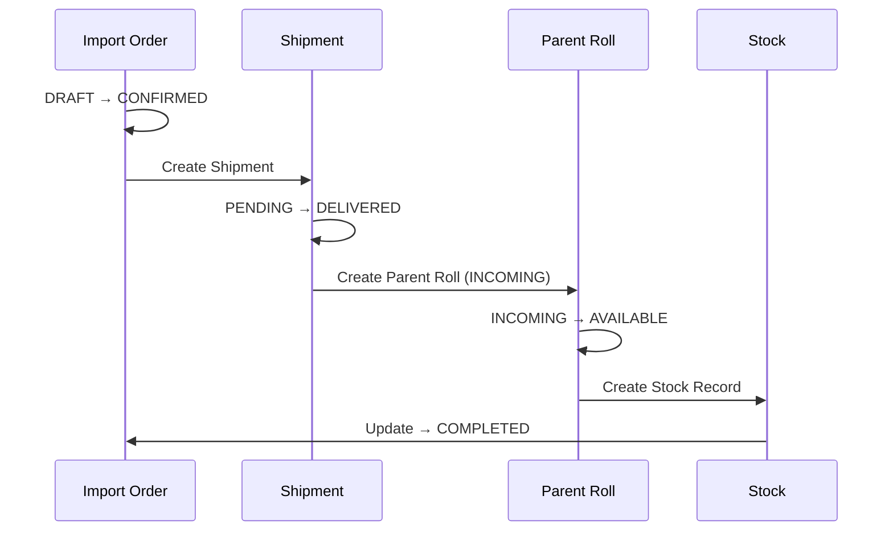
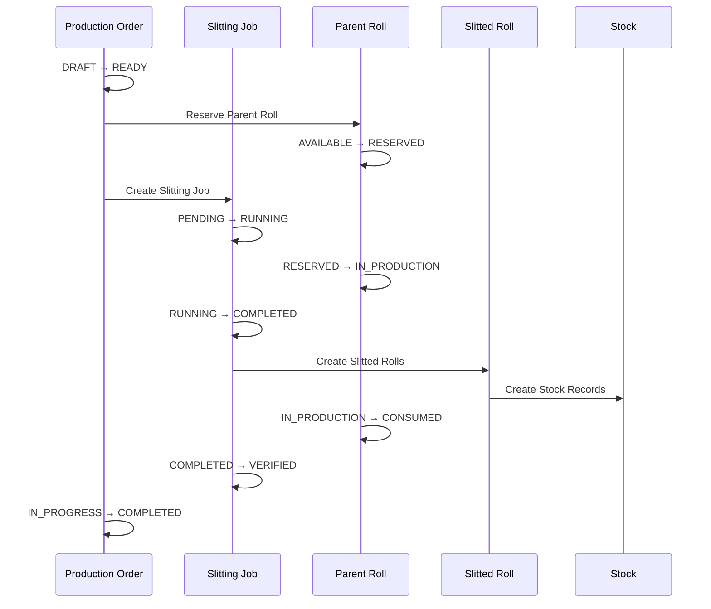

# Entity State Transitions

This document defines the canonical state machines for core domain entities in CHISAN Platform.
All status transitions must follow these definitions to ensure data consistency and business rule compliance.

## Overview

### Entities with State Management

| Entity | Module | Status Column | Description |
|--------|--------|---------------|-------------|
| Import Order | Import | `status` | Purchase order lifecycle |
| Shipment | Import | `status` | Shipment tracking lifecycle |
| Production Order | Production | `status` | Production planning lifecycle |
| Slitting Job | Production | `status` | Individual work unit lifecycle |
| Parent Roll | Inventory | `status` | Raw material lifecycle |
| Stock Item | Inventory | `status` | General inventory item status |

### State Transition Principles

1. **All transitions via API**: Status changes MUST go through NestJS API endpoints
2. **Audit logging**: Every status change creates an audit log entry
3. **Validation first**: Business rules are validated before transition
4. **Idempotent operations**: Repeated calls with same data should not cause errors

---

## 1. Import Order State Machine

### 1.1 State Diagram



### 1.2 Status Definitions

| Status | Code | Description |
|--------|------|-------------|
| **Draft** | `DRAFT` | Order created but not sent to supplier |
| **Submitted** | `SUBMITTED` | Order sent to supplier, awaiting confirmation |
| **Confirmed** | `CONFIRMED` | Supplier confirmed the order |
| **Rejected** | `REJECTED` | Supplier rejected the order |
| **Partially Shipped** | `PARTIALLY_SHIPPED` | Some items have been shipped |
| **Fully Shipped** | `FULLY_SHIPPED` | All items have been shipped |
| **Partially Received** | `PARTIALLY_RECEIVED` | Some items received at warehouse |
| **Completed** | `COMPLETED` | All items received, order fulfilled |
| **Cancelled** | `CANCELLED` | Order cancelled (terminal state) |

### 1.3 Transition Rules

| From | To | Trigger | API Endpoint | Business Rules |
|------|----|---------|--------------|--------------------|
| - | `DRAFT` | Create | `POST /api/v1/import/orders` | Partner must exist |
| `DRAFT` | `SUBMITTED` | Submit | `PATCH /api/v1/import/orders/:id/submit` | At least 1 item required |
| `DRAFT` | `CANCELLED` | Cancel | `PATCH /api/v1/import/orders/:id/cancel` | - |
| `SUBMITTED` | `CONFIRMED` | Confirm | `PATCH /api/v1/import/orders/:id/confirm` | - |
| `SUBMITTED` | `REJECTED` | Reject | `PATCH /api/v1/import/orders/:id/reject` | Rejection reason required |
| `SUBMITTED` | `DRAFT` | Revise | `PATCH /api/v1/import/orders/:id/revise` | - |
| `CONFIRMED` | `PARTIALLY_SHIPPED` | Ship | Auto (when shipment created) | - |
| `CONFIRMED` | `CANCELLED` | Cancel | `PATCH /api/v1/import/orders/:id/cancel` | Cancellation reason required |
| `PARTIALLY_SHIPPED` | `FULLY_SHIPPED` | Ship | Auto (when all items shipped) | - |
| `FULLY_SHIPPED` | `PARTIALLY_RECEIVED` | Receive | Auto (when first stock-in) | - |
| `PARTIALLY_RECEIVED` | `COMPLETED` | Receive | Auto (when all items received) | - |
| `REJECTED` | `DRAFT` | Revise | `PATCH /api/v1/import/orders/:id/revise` | - |
| `REJECTED` | `CANCELLED` | Cancel | `PATCH /api/v1/import/orders/:id/cancel` | - |

---

## 2. Shipment State Machine

### 2.1 State Diagram



### 2.2 Status Definitions

| Status | Code | Description |
|--------|------|-------------|
| **Pending** | `PENDING` | Shipment registered, awaiting departure |
| **Departed** | `DEPARTED` | Vessel has departed from origin port |
| **In Transit** | `IN_TRANSIT` | Currently on sea voyage |
| **Arrived** | `ARRIVED` | Arrived at destination port |
| **Customs Clearance** | `CUSTOMS_CLEARANCE` | In customs clearance process |
| **Customs Held** | `CUSTOMS_HELD` | Held by customs (issue) |
| **Customs Cleared** | `CUSTOMS_CLEARED` | Customs clearance completed |
| **In Delivery** | `IN_DELIVERY` | Domestic transport to warehouse |
| **Delivered** | `DELIVERED` | Physically arrived at warehouse |
| **Stock-In Progress** | `STOCK_IN_PROGRESS` | Stock-in process ongoing |
| **Completed** | `COMPLETED` | All items received into inventory |
| **Cancelled** | `CANCELLED` | Shipment cancelled |

### 2.3 Transition Rules

| From | To | Trigger | API Endpoint | Business Rules |
|------|----|---------|--------------|--------------------|
| - | `PENDING` | Create | `POST /api/v1/import/shipments` | Order must be CONFIRMED+ |
| `PENDING` | `DEPARTED` | Depart | `PATCH /api/v1/import/shipments/:id/depart` | ETD must be set |
| `PENDING` | `CANCELLED` | Cancel | `PATCH /api/v1/import/shipments/:id/cancel` | - |
| `DEPARTED` | `IN_TRANSIT` | Update | `PATCH /api/v1/import/shipments/:id/transit` | - |
| `IN_TRANSIT` | `ARRIVED` | Arrive | `PATCH /api/v1/import/shipments/:id/arrive` | - |
| `ARRIVED` | `CUSTOMS_CLEARANCE` | Clear | `PATCH /api/v1/import/shipments/:id/customs` | - |
| `CUSTOMS_CLEARANCE` | `CUSTOMS_CLEARED` | Clear | `PATCH /api/v1/import/shipments/:id/customs-clear` | - |
| `CUSTOMS_CLEARANCE` | `CUSTOMS_HELD` | Hold | `PATCH /api/v1/import/shipments/:id/customs-hold` | Hold reason required |
| `CUSTOMS_HELD` | `CUSTOMS_CLEARED` | Clear | `PATCH /api/v1/import/shipments/:id/customs-clear` | - |
| `CUSTOMS_CLEARED` | `IN_DELIVERY` | Deliver | `PATCH /api/v1/import/shipments/:id/deliver` | - |
| `IN_DELIVERY` | `DELIVERED` | Arrive | `PATCH /api/v1/import/shipments/:id/warehouse-arrive` | - |
| `DELIVERED` | `STOCK_IN_PROGRESS` | Stock | Auto (when first item scanned) | - |
| `STOCK_IN_PROGRESS` | `COMPLETED` | Complete | Auto (when all items stocked) | - |

---

## 3. Production Order State Machine

### 3.1 State Diagram



### 3.2 Status Definitions

| Status | Code | Description |
|--------|------|-------------|
| **Draft** | `DRAFT` | Order created, not yet scheduled |
| **Planned** | `PLANNED` | Scheduled for specific date |
| **Ready** | `READY` | Materials allocated, ready to start |
| **In Progress** | `IN_PROGRESS` | Production actively ongoing |
| **On Hold** | `ON_HOLD` | Temporarily paused |
| **Completed** | `COMPLETED` | All slitting jobs finished |
| **Closed** | `CLOSED` | Final review completed, order archived |
| **Cancelled** | `CANCELLED` | Order cancelled |

### 3.3 Transition Rules

| From | To | Trigger | API Endpoint | Business Rules |
|------|----|---------|--------------|--------------------|
| - | `DRAFT` | Create | `POST /api/v1/production/orders` | - |
| `DRAFT` | `PLANNED` | Plan | `PATCH /api/v1/production/orders/:id/plan` | Target date required |
| `DRAFT` | `CANCELLED` | Cancel | `PATCH /api/v1/production/orders/:id/cancel` | - |
| `PLANNED` | `READY` | Allocate | `PATCH /api/v1/production/orders/:id/allocate` | Materials must be available |
| `PLANNED` | `CANCELLED` | Cancel | `PATCH /api/v1/production/orders/:id/cancel` | - |
| `READY` | `IN_PROGRESS` | Start | `PATCH /api/v1/production/orders/:id/start` | - |
| `READY` | `PLANNED` | Deallocate | `PATCH /api/v1/production/orders/:id/deallocate` | - |
| `IN_PROGRESS` | `COMPLETED` | Complete | Auto (when all jobs done) | - |
| `IN_PROGRESS` | `ON_HOLD` | Hold | `PATCH /api/v1/production/orders/:id/hold` | Hold reason required |
| `ON_HOLD` | `IN_PROGRESS` | Resume | `PATCH /api/v1/production/orders/:id/resume` | - |
| `ON_HOLD` | `CANCELLED` | Cancel | `PATCH /api/v1/production/orders/:id/cancel` | Partial output handling required |
| `COMPLETED` | `CLOSED` | Close | `PATCH /api/v1/production/orders/:id/close` | Yield analysis completed |

---

## 4. Slitting Job State Machine

### 4.1 State Diagram



### 4.2 Status Definitions

| Status | Code | Description |
|--------|------|-------------|
| **Pending** | `PENDING` | Job created, awaiting materials |
| **Ready** | `READY` | Materials staged at machine |
| **Running** | `RUNNING` | Machine actively slitting |
| **Paused** | `PAUSED` | Temporarily stopped |
| **Completed** | `COMPLETED` | Slitting finished, awaiting QC |
| **Failed** | `FAILED` | Machine error occurred |
| **Verified** | `VERIFIED` | QC passed, output accepted |
| **Rejected** | `REJECTED` | QC failed |
| **Cancelled** | `CANCELLED` | Job cancelled |

### 4.3 Transition Rules

| From | To | Trigger | API Endpoint | Business Rules |
|------|----|---------|--------------|--------------------|
| - | `PENDING` | Create | `POST /api/v1/production/jobs` | Production order must exist |
| `PENDING` | `READY` | Stage | `PATCH /api/v1/production/jobs/:id/stage` | Parent roll scanned |
| `PENDING` | `CANCELLED` | Cancel | `PATCH /api/v1/production/jobs/:id/cancel` | - |
| `READY` | `RUNNING` | Start | `PATCH /api/v1/production/jobs/:id/start` | Operator assigned |
| `READY` | `PENDING` | Unstage | `PATCH /api/v1/production/jobs/:id/unstage` | - |
| `RUNNING` | `PAUSED` | Pause | `PATCH /api/v1/production/jobs/:id/pause` | - |
| `RUNNING` | `COMPLETED` | Complete | `PATCH /api/v1/production/jobs/:id/complete` | Output recorded |
| `RUNNING` | `FAILED` | Fail | `PATCH /api/v1/production/jobs/:id/fail` | Error code required |
| `PAUSED` | `RUNNING` | Resume | `PATCH /api/v1/production/jobs/:id/resume` | - |
| `PAUSED` | `CANCELLED` | Cancel | `PATCH /api/v1/production/jobs/:id/cancel` | - |
| `FAILED` | `PENDING` | Reset | `PATCH /api/v1/production/jobs/:id/reset` | - |
| `FAILED` | `CANCELLED` | Cancel | `PATCH /api/v1/production/jobs/:id/cancel` | - |
| `COMPLETED` | `VERIFIED` | Verify | `PATCH /api/v1/production/jobs/:id/verify` | QC check passed |
| `COMPLETED` | `REJECTED` | Reject | `PATCH /api/v1/production/jobs/:id/reject` | Rejection reason required |
| `REJECTED` | `PENDING` | Rework | `PATCH /api/v1/production/jobs/:id/rework` | - |
| `REJECTED` | `CANCELLED` | Scrap | `PATCH /api/v1/production/jobs/:id/scrap` | Scrap recorded |

---

## 5. Parent Roll State Machine

### 5.1 State Diagram



### 5.2 Status Definitions

| Status | Code | Description |
|--------|------|-------------|
| **Incoming** | `INCOMING` | Arrived but not yet stocked in |
| **Available** | `AVAILABLE` | In stock, ready for use |
| **Reserved** | `RESERVED` | Allocated to production order |
| **In Production** | `IN_PRODUCTION` | Currently being processed |
| **Partially Used** | `PARTIALLY_USED` | Remnant exists after slitting |
| **Consumed** | `CONSUMED` | Fully consumed in production |
| **Quarantine** | `QUARANTINE` | Isolated due to quality issue |
| **Disposed** | `DISPOSED` | Scrapped or discarded |

### 5.3 Transition Rules

| From | To | Trigger | API Endpoint | Business Rules |
|------|----|---------|--------------|--------------------|
| - | `INCOMING` | Arrive | Auto (shipment delivered) | - |
| `INCOMING` | `AVAILABLE` | Stock-in | `POST /api/v1/inventory/inbound` | Location assigned, barcode attached |
| `INCOMING` | `QUARANTINE` | Quarantine | `PATCH /api/v1/inventory/items/:id/quarantine` | Issue description required |
| `QUARANTINE` | `AVAILABLE` | Release | `PATCH /api/v1/inventory/items/:id/release` | Resolution documented |
| `QUARANTINE` | `DISPOSED` | Dispose | `PATCH /api/v1/inventory/items/:id/dispose` | Disposal reason required |
| `AVAILABLE` | `RESERVED` | Reserve | `PATCH /api/v1/inventory/items/:id/reserve` | Production order ID required |
| `AVAILABLE` | `QUARANTINE` | Quarantine | `PATCH /api/v1/inventory/items/:id/quarantine` | Issue description required |
| `RESERVED` | `AVAILABLE` | Release | `PATCH /api/v1/inventory/items/:id/release` | - |
| `RESERVED` | `IN_PRODUCTION` | Consume | Auto (job started) | - |
| `IN_PRODUCTION` | `CONSUMED` | Finish | Auto (job completed, no remnant) | - |
| `IN_PRODUCTION` | `PARTIALLY_USED` | Finish | Auto (job completed, remnant exists) | - |
| `PARTIALLY_USED` | `AVAILABLE` | Return | `POST /api/v1/inventory/inbound` | New weight recorded |

---

## 6. Stock Item (Generic) State Machine

### 6.1 State Diagram



### 6.2 Status Definitions

| Status | Code | Description |
|--------|------|-------------|
| **Available** | `AVAILABLE` | In stock, ready for sale/use |
| **Reserved** | `RESERVED` | Allocated to sales order |
| **Outbound** | `OUTBOUND` | Picked for shipment |
| **Shipped** | `SHIPPED` | Left the warehouse |
| **Quarantine** | `QUARANTINE` | Isolated due to issue |
| **Disposed** | `DISPOSED` | Scrapped or returned |

---

## 7. Cross-Entity State Flow

### 7.1 Import to Inventory Flow



### 7.2 Production Flow



---

## 8. Database Schema for Status

### 8.1 Status Column Convention

All status columns follow this pattern:

```sql
-- Enum type for each entity
CREATE TYPE import_order_status AS ENUM (
  'DRAFT',
  'SUBMITTED',
  'CONFIRMED',
  'REJECTED',
  'PARTIALLY_SHIPPED',
  'FULLY_SHIPPED',
  'PARTIALLY_RECEIVED',
  'COMPLETED',
  'CANCELLED'
);

-- Usage in table
CREATE TABLE import_orders (
  id UUID PRIMARY KEY DEFAULT gen_random_uuid(),
  -- ... other columns
  status import_order_status NOT NULL DEFAULT 'DRAFT',
  status_changed_at TIMESTAMPTZ DEFAULT NOW(),
  status_changed_by UUID REFERENCES users(id),
  -- ... timestamps
);

-- Index for status queries
CREATE INDEX idx_import_orders_status ON import_orders(status);
```

### 8.2 Status History Table (Optional)

For entities requiring detailed status history:

```sql
CREATE TABLE status_history (
  id UUID PRIMARY KEY DEFAULT gen_random_uuid(),
  entity_type TEXT NOT NULL,        -- 'import_order', 'shipment', etc.
  entity_id UUID NOT NULL,
  from_status TEXT,
  to_status TEXT NOT NULL,
  changed_by UUID REFERENCES users(id),
  changed_at TIMESTAMPTZ DEFAULT NOW(),
  reason TEXT,
  metadata JSONB
);

CREATE INDEX idx_status_history_entity ON status_history(entity_type, entity_id);
```

---

## 9. Implementation Guidelines

### 9.1 Status Transition Service Pattern

```typescript
// Example: Import Order Status Service
@Injectable()
export class ImportOrderStatusService {
  private readonly transitions: Map<string, string[]> = new Map([
    ['DRAFT', ['SUBMITTED', 'CANCELLED']],
    ['SUBMITTED', ['CONFIRMED', 'REJECTED', 'DRAFT']],
    ['CONFIRMED', ['PARTIALLY_SHIPPED', 'CANCELLED']],
    // ... other transitions
  ]);

  async transition(
    orderId: string, 
    targetStatus: ImportOrderStatus,
    context: TransitionContext
  ): Promise<ImportOrder> {
    const order = await this.findOrThrow(orderId);
    
    // 1. Validate transition is allowed
    this.validateTransition(order.status, targetStatus);
    
    // 2. Execute business rules
    await this.executeBusinessRules(order, targetStatus, context);
    
    // 3. Update status
    const updated = await this.updateStatus(order, targetStatus, context);
    
    // 4. Trigger side effects
    await this.triggerSideEffects(updated, order.status, targetStatus);
    
    // 5. Create audit log
    await this.auditLog.create({
      targetTable: 'import_orders',
      targetId: orderId,
      action: 'STATUS_CHANGE',
      changes: { 
        status: { old: order.status, new: targetStatus } 
      },
      actorId: context.userId,
    });
    
    return updated;
  }

  private validateTransition(from: string, to: string): void {
    const allowed = this.transitions.get(from) || [];
    if (!allowed.includes(to)) {
      throw new InvalidStatusTransitionError(from, to);
    }
  }
}
```

### 9.2 Frontend Status Display

```typescript
// Status badge configuration
export const STATUS_CONFIG: Record<string, StatusConfig> = {
  DRAFT: { label: 'Draft', color: 'gray', icon: 'edit' },
  SUBMITTED: { label: 'Submitted', color: 'blue', icon: 'send' },
  CONFIRMED: { label: 'Confirmed', color: 'green', icon: 'check' },
  REJECTED: { label: 'Rejected', color: 'red', icon: 'x' },
  IN_PROGRESS: { label: 'In Progress', color: 'yellow', icon: 'loader' },
  COMPLETED: { label: 'Completed', color: 'green', icon: 'check-circle' },
  CANCELLED: { label: 'Cancelled', color: 'gray', icon: 'ban' },
};
```

---

## 10. Validation Checklist

Before implementing status transitions:

- [ ] All valid transitions are defined in transition map
- [ ] Business rules documented for each transition
- [ ] API endpoints created for manual transitions
- [ ] Automatic transitions triggered by related entity changes
- [ ] Audit logging implemented for all status changes
- [ ] Frontend reflects current status with appropriate styling
- [ ] Invalid transition attempts return clear error messages
- [ ] Status history is queryable for debugging/reporting
