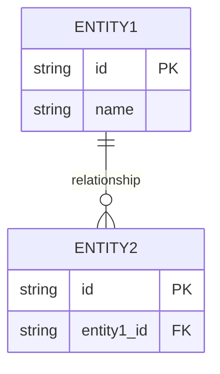
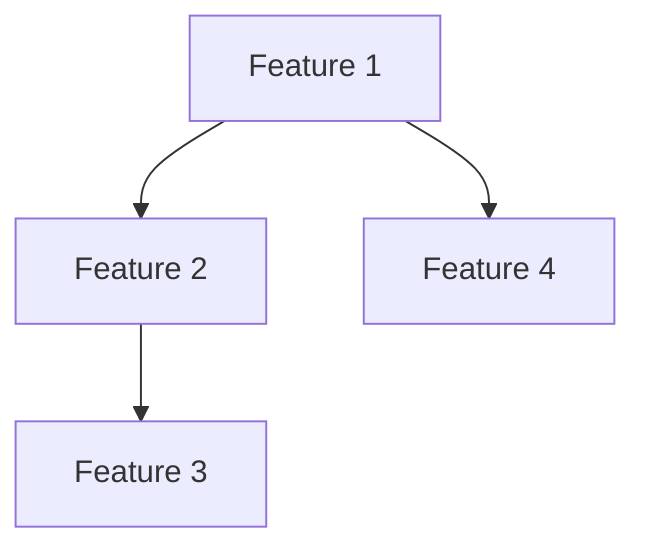

# Module Name: [Module Name]

## 1. Module Overview

[Description of the module's purpose and main role]

## 2. Domain Model

### Entities & Relationships

[Description of major entities and relationships between them]

## 3. Feature Map

[DAG showing dependencies and flow between features]

## 4. API Endpoints

| Method | Path        | Description | Roles       |
| ------ | ----------- | ----------- | ----------- |
| GET    | /api/v1/... | ...         | Admin, User |
| POST   | /api/v1/... | ...         | Admin       |

## 5. Database Schema

[Table specifications and constraints]

## 6. UI Pages

- **[Page Name]**: [Description]
  - Key Features: [Feature List]
  - Input Fields: [Field List]

## 7. Business Rules

- **[Rule 1]**: [Detailed Description]
- **[Rule 2]**: [Detailed Description]

## 8. Test Scenarios

- **[Scenario 1]**: [Process and Expected Result]
- **[Scenario 2]**: [Process and Expected Result]
