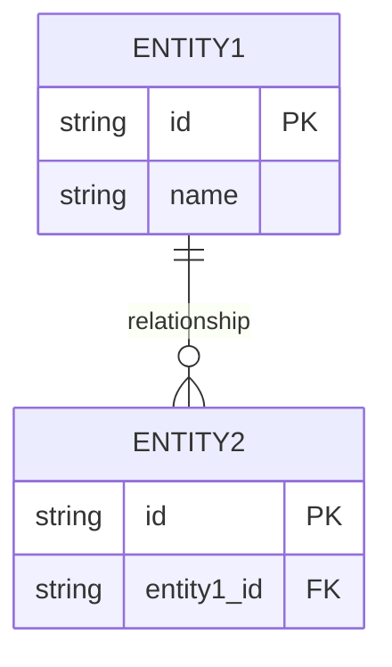
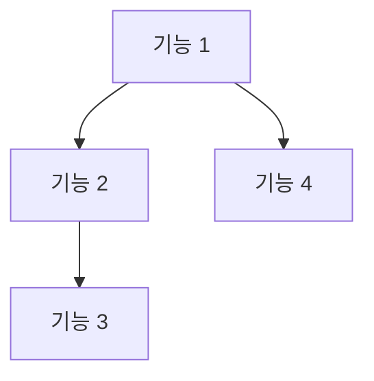

# Module Name: [모듈명]

## 1. Module Overview (모듈 개요)
[모듈의 목적과 주요 역할에 대한 설명]

## 2. Domain Model (도메인 모델)
### Entities & Relationships
[주요 엔티티와 그들 간의 관계 설명]

## 3. Feature Map (기능 맵)
[기능 간의 의존성 및 흐름을 나타내는 DAG]

## 4. API Endpoints (API 엔드포인트)
| Method | Path | Description | Roles |
|--------|------|-------------|-------|
| GET | /api/v1/... | ... | Admin, User |
| POST | /api/v1/... | ... | Admin |

## 5. Database Schema (데이터베이스 스키마)
[테이블 명세 및 제약 조건]

## 6. UI Pages (사용자 인터페이스)
- **[페이지명]**: [설명]
  - 주요 기능: [기능 목록]
  - 입력 항목: [필드 목록]

## 7. Business Rules (비즈니스 규칙)
- **[규칙 1]**: [상세 설명]
- **[규칙 2]**: [상세 설명]

## 8. Test Scenarios (테스트 시나리오)
- **[시나리오 1]**: [과정 및 기대 결과]
- **[시나리오 2]**: [과정 및 기대 결과]
