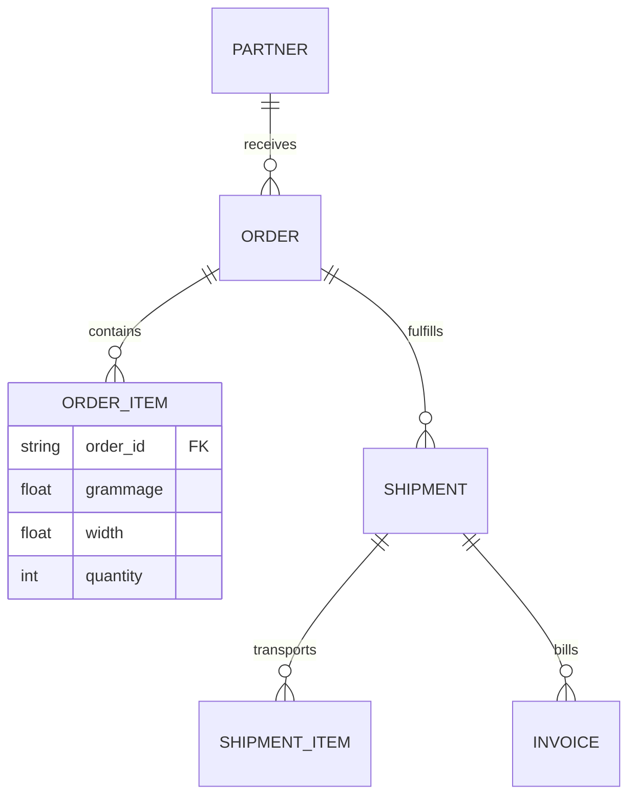
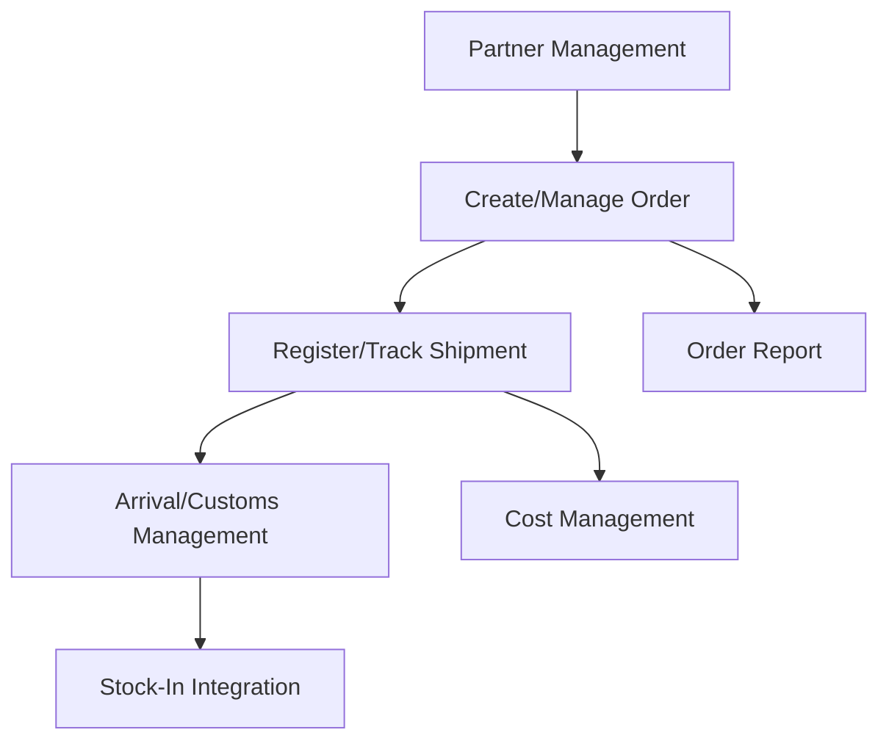

# Module: Import/Order Management

## 1. Module Overview

Manages the entire process from purchasing parent rolls from overseas suppliers to stocking them in domestic warehouses. This is a core module of import supply chain management, including Order, Shipment, Customs, Cost Settlement, and Inventory Integration.

## 2. Domain Model

### Entities & Relationships

- **Partner**: Overseas paper manufacturer or supplier
- **Order**: Purchase contract unit
- **OrderItem**: Parent roll specifications included in the order (grammage, width, etc.)
- **Shipment**: Transport information in B/L (Bill of Lading) units
- **Invoice**: Billing and expense proof materials

## 3. Feature Map

## 4. API Endpoints

| Method | Path                                   | Description                                   | Roles                    |
| ------ | -------------------------------------- | --------------------------------------------- | ------------------------ |
| POST   | /api/v1/import/orders                  | Create new purchase order                     | Purchasing Manager       |
| GET    | /api/v1/import/shipments               | Query shipment progress status                | Logistics Manager, Admin |
| PATCH  | /api/v1/import/shipments/:id/clearance | Update customs clearance status               | Logistics Manager        |
| POST   | /api/v1/import/invoices                | Register import incidental costs and invoices | Finance, Admin           |

## 5. Database Schema

- `import_orders`: `id`, `partner_id`, `order_date`, `status`, `total_amount`, `currency`
- `import_order_items`: `id`, `order_id`, `grammage`, `width`, `quantity`, `unit_price`
- `shipments`: `id`, `order_id`, `bl_number`, `vessel_name`, `etd`, `eta`, `status`
- `import_costs`: `id`, `shipment_id`, `cost_type(Tariff, Transport, etc)`, `amount`

## 6. UI Pages

- **Order Management**: Write PO, print PDF, query order history by supplier
- **Shipment Tracking Board**: Calendar view based on ETD/ETA and shipping document (B/L, Invoice) management
- **Customs/Arrival Processing**: Confirm tariff payment and switch to warehouse stock-in request
- **Import Cost Analysis**: Calculate actual landed cost by summing various incidental costs in addition to goods value

## 7. Business Rules

- **Lead Time Management**: Notify appropriate order timing by calculating average lead time by supplier
- **MOQ (Minimum Order Quantity)**: Check minimum quantity according to container unit or supplier policy
- **Exchange Rate Application**: Track foreign exchange gains/losses due to exchange rate differences between order time and payment time

## 8. Integration with inventory module

- Shipment items that have completed customs clearance are automatically sent to the Inventory module's 'Stock-In Pending' list.
- When Stock-In confirmation is completed in the warehouse, the order status is finally changed to 'Received'.
