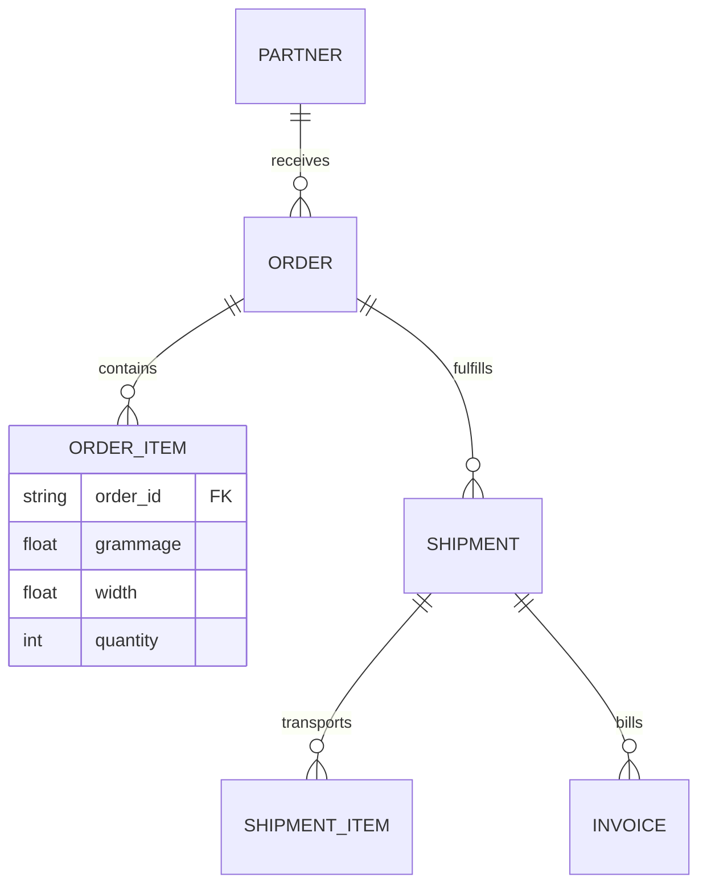
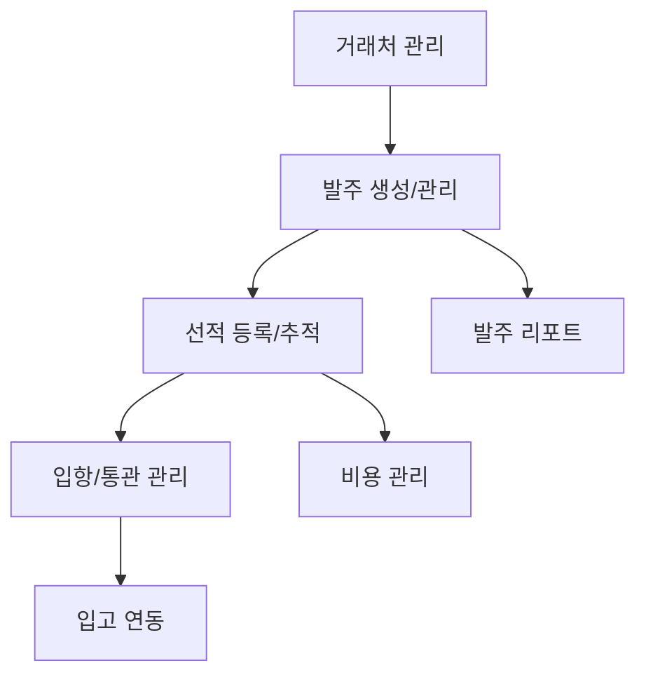

# Module: 수입/발주 관리 (Import Management)

## 1. Module Overview (모듈 개요)
해외 공급사로부터 원지를 구매하고 국내 창고에 입고되기까지의 전 과정을 관리합니다. 발주(Order), 선적(Shipment), 통관, 비용 정산 및 재고 연동을 포함하는 수입 공급망 관리의 핵심 모듈입니다.

## 2. Domain Model (도메인 모델)
### Entities & Relationships
- **Partner (거래처)**: 해외 종이 제조사 또는 공급사
- **Order (발주)**: 구매 계약 단위
- **OrderItem (발주 품목)**: 발주에 포함된 원지 사양 (평량, 지폭 등)
- **Shipment (선적)**: B/L(선하증권) 단위의 운송 정보
- **Invoice (인보이스)**: 대금 청구 및 비용 증빙 자료

## 3. Feature Map (기능 맵)

## 4. API Endpoints (API 엔드포인트)
| Method | Path | Description | Roles |
|--------|------|-------------|-------|
| POST | /api/v1/import/orders | 신규 발주서 생성 | Purchasing Manager |
| GET | /api/v1/import/shipments | 선적 진행 현황 조회 | Logistics Manager, Admin |
| PATCH | /api/v1/import/shipments/:id/clearance | 통관 상태 업데이트 | Logistics Manager |
| POST | /api/v1/import/invoices | 수입 부대비용 및 인보이스 등록 | Finance, Admin |

## 5. Database Schema (데이터베이스 스키마)
- `import_orders`: `id`, `partner_id`, `order_date`, `status`, `total_amount`, `currency`
- `import_order_items`: `id`, `order_id`, `grammage`, `width`, `quantity`, `unit_price`
- `shipments`: `id`, `order_id`, `bl_number`, `vessel_name`, `etd`, `eta`, `status`
- `import_costs`: `id`, `shipment_id`, `cost_type(Tariff, Transport, etc)`, `amount`

## 6. UI Pages (사용자 인터페이스)
- **발주 관리**: 발주서 작성, PDF 출력, 공급사별 발주 이력 조회
- **선적 추적 보드**: ETD/ETA 기반의 캘린더 뷰 및 선적 서류(B/L, Invoice) 관리
- **통관/입항 처리**: 관세 납부 확인 및 창고 입고 요청 전환
- **수입 원가 분석**: 물건값 외에 발생한 각종 부대비용을 합산한 실제 도입 원가 계산

## 7. Business Rules (비즈니스 규칙)
- **Lead Time 관리**: 공급사별 평균 리드타임을 계산하여 적정 발주 시점 알림
- **MOQ (최소 발주량)**: 컨테이너 단위 또는 공급사 정책에 따른 최소 수량 체크
- **환율 적용**: 발주 시점과 결제 시점의 환율 차이에 따른 외환 차손익 추적

## 8. Integration with inventory module (재고 연동)
- 통관이 완료된 선적 항목은 Inventory 모듈의 '입고 대기' 목록으로 자동 전송됩니다.
- 창고에서 입고 확인(Stock-In)이 완료되면 발주 상태가 '수령 완료'로 최종 변경됩니다.
