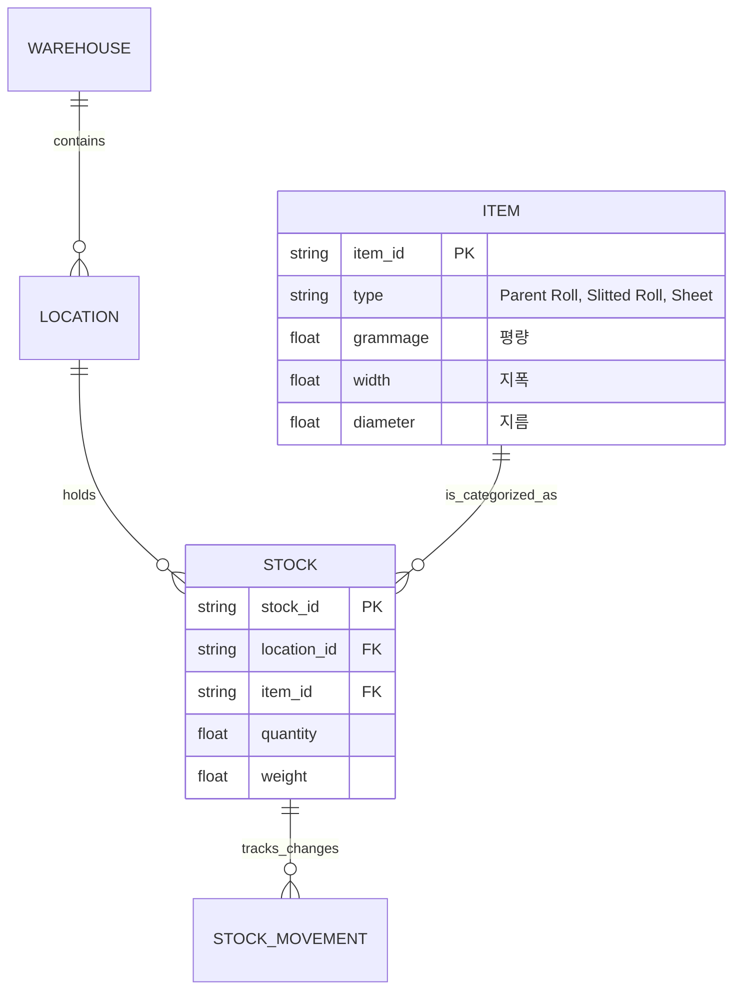
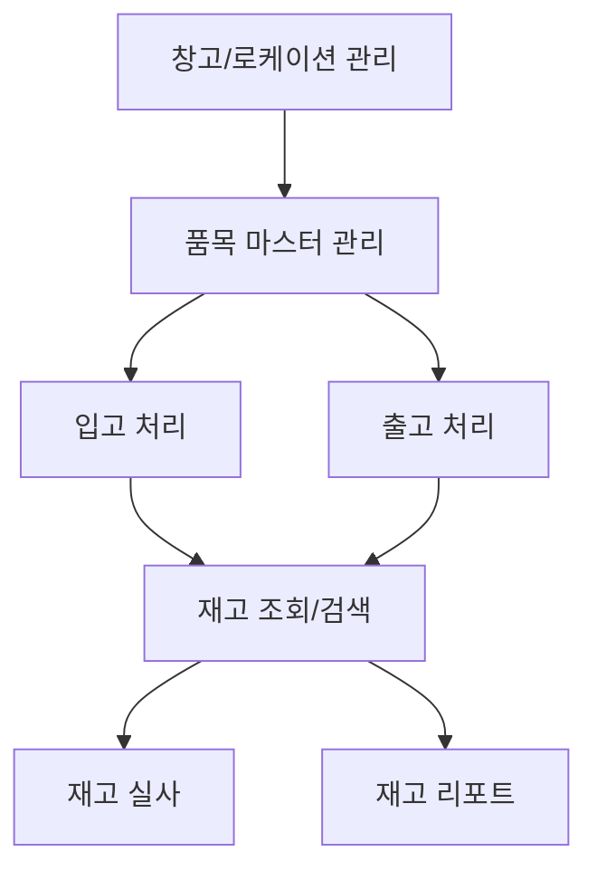

# Module: 재고관리 시스템 (Inventory / WMS)

## 1. Module Overview (모듈 개요)
지산페이퍼의 핵심 자산인 종이(원지, 슬리팅 롤, 시트)의 생애주기를 관리하는 모듈입니다. 창고 내 위치(Location) 기반의 실시간 재고 추적, 입출고 이력 관리 및 정확한 재고 실사를 지원하여 물류 효율성을 극대화합니다.

## 2. Domain Model (도메인 모델)
### Entities & Relationships
- **Warehouse (창고)**: 물리적인 보관 장소 (예: 제1창고, 외부창고)
- **Location (로케이션)**: 창고 내 세부 구역 (예: A-01-01)
- **Item (품목)**: 재고의 기본 단위
    - **Parent Roll (원지)**: 수입된 대형 롤
    - **Slitted Roll (슬리팅 롤)**: 가공 후 작은 롤
    - **Sheet (시트)**: 평판으로 절단된 종이
- **Stock (재고)**: 특정 시점의 품목별, 로케이션별 수량/중량
- **StockMovement (재고이동)**: 입고, 출고, 이동, 조정 등 모든 재고 변화 이력

## 3. Feature Map (기능 맵)

## 4. API Endpoints (API 엔드포인트)
| Method | Path | Description | Roles |
|--------|------|-------------|-------|
| GET | /api/v1/inventory/stocks | 실시간 재고 목록 조회 | Warehouse Manager, Admin |
| POST | /api/v1/inventory/inbound | 입고 등록 (수입 연동) | Warehouse Manager |
| POST | /api/v1/inventory/outbound | 출고 등록 (생산/판매 연동) | Warehouse Manager |
| PATCH | /api/v1/inventory/move | 재고 위치 이동 | Warehouse Worker |
| POST | /api/v1/inventory/audit | 재고 실사 결과 등록 | Admin |

## 5. Database Schema (데이터베이스 스키마)
- `warehouses`: `id`, `name`, `address`, `type`
- `locations`: `id`, `warehouse_id`, `zone`, `row`, `column`
- `items`: `id`, `name`, `grammage`, `width`, `category_id`
- `stocks`: `id`, `item_id`, `location_id`, `quantity`, `updated_at`
- `stock_movements`: `id`, `stock_id`, `type(IN/OUT/MOVE)`, `quantity`, `reason`, `created_at`

## 6. UI Pages (사용자 인터페이스)
- **재고 현황 대시보드**: 창고별, 품목별 재고 요약 및 가용 재고 표시
- **입출고 관리 페이지**: 입고/출고 예정 리스트 확인 및 처리 폼
- **재고 이동/조정**: QR/바코드를 활용한 위치 이동 및 수량 조정
- **재고 실사 관리**: 실사 계획 수립 및 시스템 재고 대비 실물 재고 입력

## 7. Business Rules (비즈니스 규칙)
- **선입선출(FIFO) 원칙**: 입고일이 빠른 원지부터 우선적으로 출고 권장
- **재고 격리**: 불량 판정을 받은 품목은 '격리 로케이션'으로 이동하며 가용 재고에서 제외
- **단위 환산**: 지폭, 지름, 평량을 기반으로 예상 중량(kg) 자동 계산

## 8. Integration points (타 모듈 연동)
- **Import Module**: 수입 완료된 선적 화물이 '입고 처리' 기능을 통해 재고로 자동 등록
- **Production Module**: 생산 지시 시 '원지 출고 요청'이 발생하며, 생산 완료 후 '슬리팅 롤 입고' 처리
- **Sales Module**: 판매 주문 확정 시 출고 대기 상태로 전환
