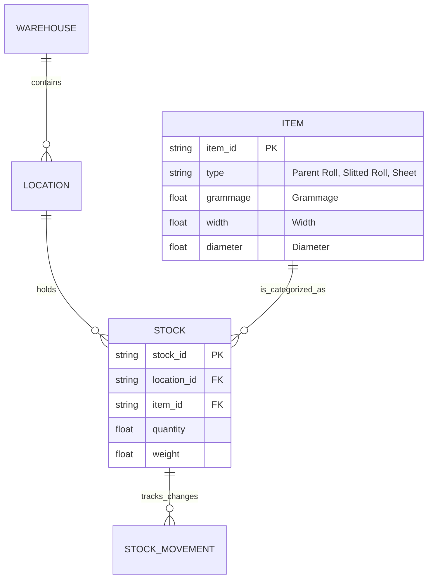
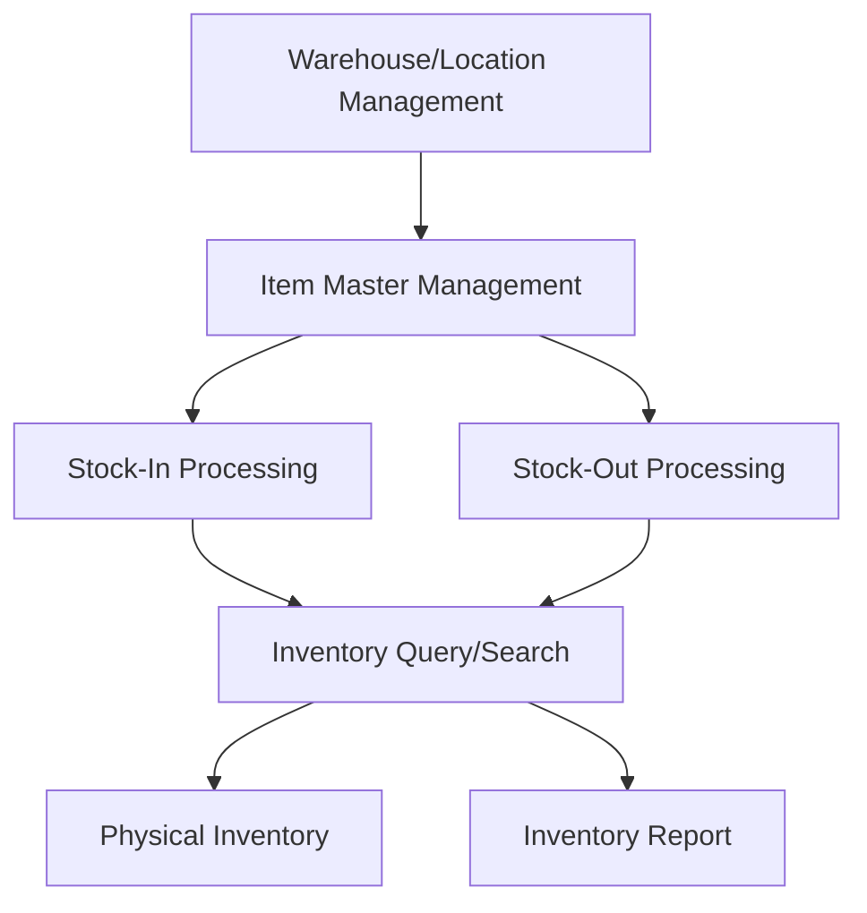

# Module: Inventory Management System (WMS)

## 1. Module Overview

A module that manages the lifecycle of CHISAN Paper's core assets: paper (Parent Roll, Slitted Roll, Sheet). Supports real-time inventory tracking based on warehouse Location, Stock-In/Out history management, and accurate physical inventory to maximize logistics efficiency.

## 2. Domain Model

### Entities & Relationships

- **Warehouse**: Physical storage place (e.g., Warehouse 1, External Warehouse)
- **Location**: Detailed area within warehouse (e.g., A-01-01)
- **Item**: Basic unit of inventory
  - **Parent Roll**: Imported large roll
  - **Slitted Roll**: Small roll after processing
  - **Sheet**: Paper cut into flat sheets
- **Stock**: Quantity/Weight by item and location at a specific point in time
- **StockMovement**: History of all inventory changes such as stock-in, stock-out, movement, adjustment

## 3. Feature Map

## 4. API Endpoints

| Method | Path                       | Description                                       | Roles                    |
| ------ | -------------------------- | ------------------------------------------------- | ------------------------ |
| GET    | /api/v1/inventory/stocks   | Query real-time inventory list                    | Warehouse Manager, Admin |
| POST   | /api/v1/inventory/inbound  | Register Stock-In (Import Integration)            | Warehouse Manager        |
| POST   | /api/v1/inventory/outbound | Register Stock-Out (Production/Sales Integration) | Warehouse Manager        |
| PATCH  | /api/v1/inventory/move     | Move inventory location                           | Warehouse Worker         |
| POST   | /api/v1/inventory/audit    | Register physical inventory results               | Admin                    |

## 5. Database Schema

- `warehouses`: `id`, `name`, `address`, `type`
- `locations`: `id`, `warehouse_id`, `zone`, `row`, `column`
- `items`: `id`, `name`, `grammage`, `width`, `category_id`
- `stocks`: `id`, `item_id`, `location_id`, `quantity`, `updated_at`
- `stock_movements`: `id`, `stock_id`, `type(IN/OUT/MOVE)`, `quantity`, `reason`, `created_at`

## 6. UI Pages

- **Inventory Status Dashboard**: Inventory summary and available inventory by warehouse and item
- **Stock-In/Out Management Page**: Check and process scheduled stock-in/out list
- **Inventory Move/Adjust**: Location movement and quantity adjustment using QR/Barcode
- **Physical Inventory Management**: Establish physical inventory plan and input physical inventory against system inventory

## 7. Business Rules

- **FIFO Principle**: Recommend stock-out of parent rolls with earlier stock-in dates first
- **Inventory Quarantine**: Defective items are moved to 'Quarantine Location' and excluded from available inventory
- **Unit Conversion**: Automatically calculate expected weight (kg) based on width, diameter, and grammage

## 8. Integration points

- **Import Module**: Imported shipments are automatically registered as inventory through 'Stock-In Processing' function
- **Production Module**: 'Parent Roll Stock-Out Request' occurs upon production order, and 'Slitted Roll Stock-In' is processed after production completion
- **Sales Module**: Switch to 'Stock-Out Pending' status upon sales order confirmation
