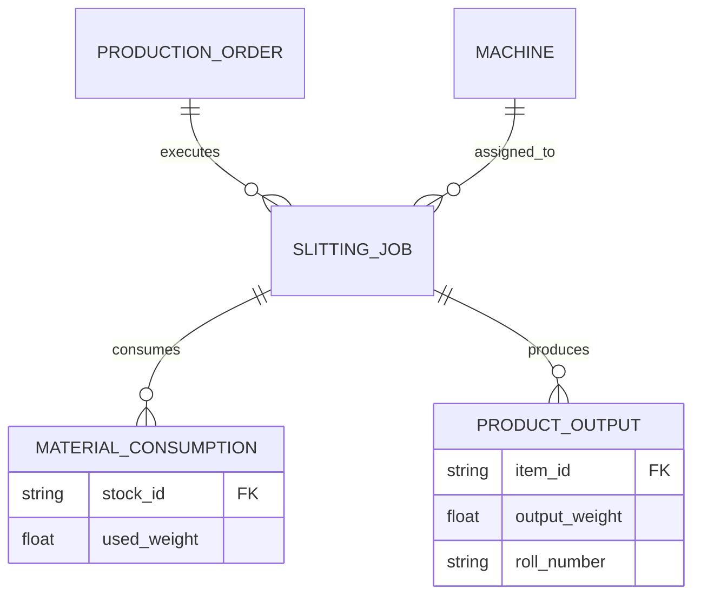
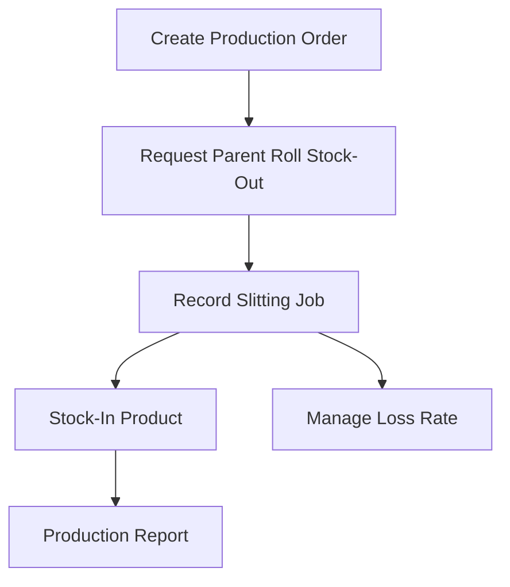

# Module: Production Management (Slitting)

## 1. Module Overview

Manages the slitting process of cutting imported large Parent Rolls into smaller rolls (Slitted Rolls) according to customer specifications. Performs production orders, raw material consumption, work recording, product stock-in, and yield analysis.

## 2. Domain Model

### Entities & Relationships

- **ProductionOrder**: Production target to be achieved on a specific date
- **SlittingJob**: Individual work unit actually performed on the machine
- **MaterialConsumption**: Input Parent Roll information
- **ProductOutput**: Produced Slitted Rolls
- **Machine**: Equipment used in the process

## 3. Feature Map

## 4. API Endpoints

| Method | Path                               | Description                            | Roles                     |
| ------ | ---------------------------------- | -------------------------------------- | ------------------------- |
| POST   | /api/v1/production/orders          | Register new production order          | Production Planner        |
| GET    | /api/v1/production/jobs            | Monitor real-time job status           | Production Manager, Admin |
| POST   | /api/v1/production/jobs/:id/report | Report job results (input/output)      | Machine Operator          |
| GET    | /api/v1/production/yield-analysis  | Yield and loss rate analysis by period | Admin                     |

## 5. Database Schema

- `production_orders`: `id`, `target_date`, `priority`, `status`
- `slitting_jobs`: `id`, `order_id`, `machine_id`, `start_time`, `end_time`, `operator_name`
- `production_inputs`: `id`, `job_id`, `parent_roll_id`, `input_weight`
- `production_outputs`: `id`, `job_id`, `slitted_roll_id`, `output_weight`, `grade`

## 6. UI Pages

- **Production Scheduler**: Manage production plans by machine/date (Drag and Drop support)
- **Field Worker Terminal**: Simplified UI for scanning parent roll barcodes, entering production quantity, and recording defect reasons
- **Slitting Pattern Setting**: Setting and optimization guide for how to divide parent roll width (Cutter position)
- **Yield Report**: Analysis chart of finished product ratio to raw material and scrap generation

## 7. Business Rules

- **Loss Rate Calculation**: `(Input Weight - Output Weight) / Input Weight * 100`. Reason entry mandatory if exceeding specific threshold (e.g., 5%)
- **Remnant Handling**: Choose whether to return remaining parent roll to stock or dispose of it
- **Numbering System**: Assign tracking numbers linked to parent roll's Lot number to produced slitted rolls

## 8. Integration with inventory module

- **Stock-Out Request**: Required parent rolls switch to 'Production Pending' status in inventory when production starts.
- **Result Stock-In**: Produced slitted rolls are automatically registered in the inventory system upon job completion report.
- **Consumables Consumption**: Inventory of consumables such as packaging materials and cores is also deducted.
