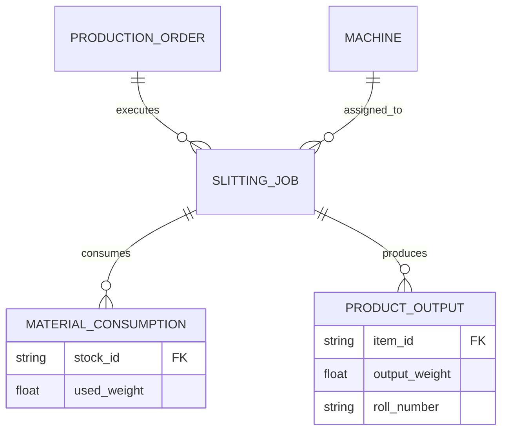
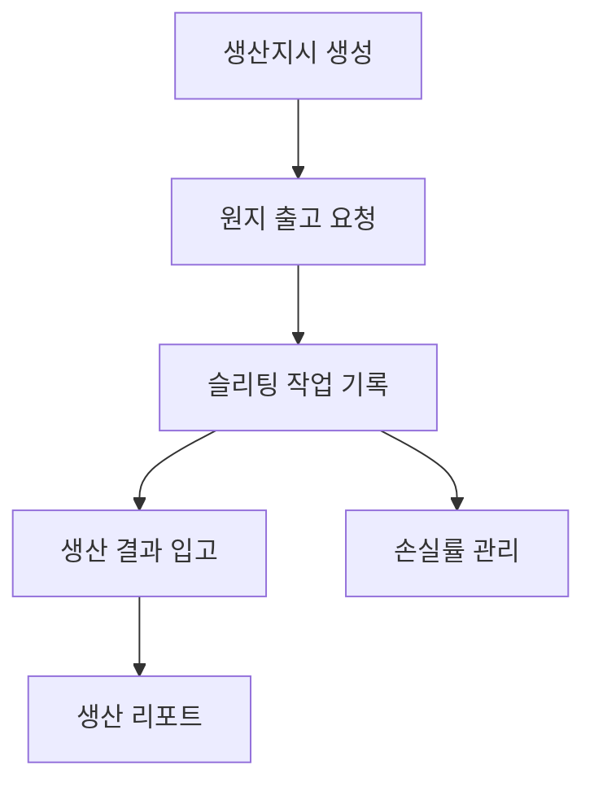

# Module: 슬리팅 생산관리 (Production Management)

## 1. Module Overview (모듈 개요)
수입된 대형 원지(Parent Roll)를 고객사의 요구 사양에 맞춰 작은 롤(Slitted Roll)로 절단하는 슬리팅 공정을 관리합니다. 생산 지시, 원자재 소비, 작업 기록, 결과물 입고 및 수율(Yield) 분석을 수행합니다.

## 2. Domain Model (도메인 모델)
### Entities & Relationships
- **ProductionOrder (생산지시)**: 특정 날짜에 생산해야 할 작업 목표
- **SlittingJob (슬리팅 작업)**: 실제 기계에서 수행되는 개별 작업 단위
- **MaterialConsumption (원자재 소비)**: 투입된 원지(Parent Roll) 정보
- **ProductOutput (생산 결과물)**: 생산된 슬리팅 롤들
- **Machine (슬리팅 기계)**: 공정에 사용되는 설비

## 3. Feature Map (기능 맵)

## 4. API Endpoints (API 엔드포인트)
| Method | Path | Description | Roles |
|--------|------|-------------|-------|
| POST | /api/v1/production/orders | 신규 생산지시 등록 | Production Planner |
| GET | /api/v1/production/jobs | 실시간 작업 현황 모니터링 | Production Manager, Admin |
| POST | /api/v1/production/jobs/:id/report | 작업 결과(투입/산출) 보고 | Machine Operator |
| GET | /api/v1/production/yield-analysis | 기간별 수율 및 손실률 분석 | Admin |

## 5. Database Schema (데이터베이스 스키마)
- `production_orders`: `id`, `target_date`, `priority`, `status`
- `slitting_jobs`: `id`, `order_id`, `machine_id`, `start_time`, `end_time`, `operator_name`
- `production_inputs`: `id`, `job_id`, `parent_roll_id`, `input_weight`
- `production_outputs`: `id`, `job_id`, `slitted_roll_id`, `output_weight`, `grade`

## 6. UI Pages (사용자 인터페이스)
- **생산 스케줄러**: 기계별/일자별 생산 계획 관리 (드래그 앤 드롭 지원)
- **현장 작업자 터미널**: 원지 바코드 스캔, 생산 수량 입력, 불량 사유 기록용 단순화된 UI
- **슬리팅 패턴 설정**: 원지 지폭을 어떻게 나눌지(Cutter position) 설정 및 최적화 가이드
- **수율 리포트**: 원자재 대비 완제품 비율 및 자투리(Scrap) 발생량 분석 차트

## 7. Business Rules (비즈니스 규칙)
- **손실률 계산 (Loss Rate)**: `(투입 중량 - 산출 중량) / 투입 중량 * 100`. 특정 임계치(예: 5%) 초과 시 사유 입력 필수
- **잔량 처리**: 사용하고 남은 원지는 다시 재고로 입고하거나 폐기 처리 선택
- **번호 체계**: 생산된 슬리팅 롤에는 원지의 Lot 번호와 연동된 추적 번호 부여

## 8. Integration with inventory module (재고 연동)
- **출고 요청**: 생산 시작 시 필요한 원지가 재고에서 '생산 대기' 상태로 전환됩니다.
- **결과 입고**: 작업 완료 보고 시 생산된 슬리팅 롤들이 자동으로 재고 시스템에 등록됩니다.
- **원부자재 소비**: 포장재, 지관(Core) 등의 소모품 재고도 함께 차감됩니다.
