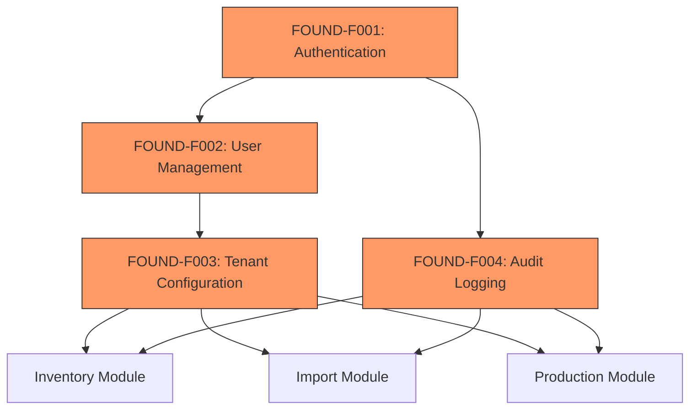

# Foundation Feature Set Specification

This document provides detailed specifications for the Foundation feature set (FOUND-F001 ~ F004).
Foundation features are prerequisites for all other modules and must be completed first.

## Overview

### Feature List

| ID | Name | Priority | Dependencies |
|----|------|----------|--------------|
| FOUND-F001 | Authentication | P0 | None |
| FOUND-F002 | User Management | P0 | FOUND-F001 |
| FOUND-F003 | Tenant Configuration | P0 | FOUND-F002 |
| FOUND-F004 | Audit Logging | P0 | FOUND-F001 |

### Dependency Graph



---

## FOUND-F001: Authentication

### Business Context

CHISAN Paper uses Google Workspace for internal communication. All employees have `@chisanpaper.com` Google accounts. The system leverages existing Google accounts for SSO to minimize onboarding friction.

### Functional Requirements

| ID | Requirement | Priority |
|----|-------------|----------|
| F001-R01 | Users can sign in using Google OAuth | Must |
| F001-R02 | Only `@chisanpaper.com` domain emails allowed | Must |
| F001-R03 | Session persists across browser tabs | Must |
| F001-R04 | Session expires after 7 days of inactivity | Should |
| F001-R05 | Users can manually sign out | Must |
| F001-R06 | Failed login attempts are logged | Must |

### Technical Implementation

#### Supabase Auth Configuration

```typescript
// Auth provider configuration
const authConfig = {
  providers: ['google'],
  redirectTo: `${process.env.NEXT_PUBLIC_APP_URL}/auth/callback`,
  options: {
    hd: 'chisanpaper.com', // Restrict to company domain
  },
};
```

#### Database Schema

```sql
-- Supabase Auth handles the auth.users table
-- We extend with a public.users table for app-specific data

CREATE TABLE users (
  id UUID PRIMARY KEY REFERENCES auth.users(id) ON DELETE CASCADE,
  email TEXT UNIQUE NOT NULL,
  display_name TEXT,
  avatar_url TEXT,
  is_active BOOLEAN DEFAULT true,
  last_login_at TIMESTAMPTZ,
  created_at TIMESTAMPTZ DEFAULT NOW(),
  updated_at TIMESTAMPTZ DEFAULT NOW()
);

-- Auto-create user record on first login
CREATE OR REPLACE FUNCTION handle_new_user()
RETURNS TRIGGER AS $$
BEGIN
  INSERT INTO public.users (id, email, display_name, avatar_url)
  VALUES (
    NEW.id,
    NEW.email,
    NEW.raw_user_meta_data->>'full_name',
    NEW.raw_user_meta_data->>'avatar_url'
  );
  RETURN NEW;
END;
$$ LANGUAGE plpgsql SECURITY DEFINER;

CREATE TRIGGER on_auth_user_created
  AFTER INSERT ON auth.users
  FOR EACH ROW EXECUTE FUNCTION handle_new_user();
```

#### API Endpoints

| Method | Path | Description |
|--------|------|-------------|
| GET | `/auth/login` | Redirect to Google OAuth |
| GET | `/auth/callback` | Handle OAuth callback |
| POST | `/auth/logout` | Sign out and clear session |
| GET | `/auth/me` | Get current user info |

### UI Screens

1. **Login Page** (`/login`)
   - Company logo
   - "Sign in with Google" button
   - Domain restriction notice

2. **Auth Callback** (`/auth/callback`)
   - Loading spinner during token exchange
   - Error handling for unauthorized domains

### Acceptance Criteria

- [ ] User can sign in with Google account
- [ ] Non-company domain emails are rejected with clear error
- [ ] Session persists after browser refresh
- [ ] Sign out clears all session data
- [ ] Login events are recorded in audit log

---

## FOUND-F002: User Management

### Business Context

System administrators need to manage user access and assign roles. The initial deployment supports 6 users, scaling to 20+ within 2 years.

### Role Definitions

| Role | Code | Description | Count (Initial) |
|------|------|-------------|-----------------|
| **Admin** | `admin` | Full system access, user management | 1-2 |
| **Manager** | `manager` | Department operations, reports, approvals | 2-3 |
| **Worker** | `worker` | Day-to-day operations, data entry | 3-4 |

### Permission Matrix

| Permission | Admin | Manager | Worker | Description |
|------------|:-----:|:-------:|:------:|-------------|
| **User Management** |
| View users | O | O | X | See user list |
| Create/Edit users | O | X | X | Add/modify user accounts |
| Assign roles | O | X | X | Change user roles |
| Deactivate users | O | X | X | Disable user access |
| **Master Data** |
| View master data | O | O | O | Warehouses, items, partners |
| Create master data | O | O | X | Add new records |
| Edit master data | O | O | X | Modify existing records |
| Delete master data | O | X | X | Remove records (soft delete) |
| **Inventory** |
| View inventory | O | O | O | Stock levels, locations |
| Process stock-in | O | O | O | Receive inventory |
| Process stock-out | O | O | O | Ship/consume inventory |
| Adjust inventory | O | O | X | Manual corrections |
| **Import** |
| View orders | O | O | O | See purchase orders |
| Create orders | O | O | X | New purchase orders |
| Approve orders | O | O | X | Confirm orders |
| Cancel orders | O | X | X | Cancel orders |
| **Production** |
| View production | O | O | O | See production orders |
| Create production orders | O | O | X | New production plans |
| Record job results | O | O | O | Enter production data |
| Close production orders | O | O | X | Finalize orders |
| **Reports & Analytics** |
| View operational reports | O | O | O | Daily/weekly reports |
| View financial reports | O | O | X | Cost, margin analysis |
| Export data | O | O | X | Download reports |
| **System** |
| View audit logs | O | X | X | Security audit trail |
| Manage settings | O | X | X | System configuration |

### Functional Requirements

| ID | Requirement | Priority |
|----|-------------|----------|
| F002-R01 | Admin can view all users | Must |
| F002-R02 | Admin can assign/change user roles | Must |
| F002-R03 | Admin can deactivate users | Must |
| F002-R04 | Users cannot modify their own role | Must |
| F002-R05 | At least one admin must exist | Must |
| F002-R06 | Role changes take effect immediately | Should |
| F002-R07 | Role change history is logged | Must |

### Database Schema

```sql
-- Role enum
CREATE TYPE user_role AS ENUM ('admin', 'manager', 'worker');

-- User roles table (supports multiple roles per user if needed later)
CREATE TABLE user_roles (
  id UUID PRIMARY KEY DEFAULT gen_random_uuid(),
  user_id UUID NOT NULL REFERENCES users(id) ON DELETE CASCADE,
  role user_role NOT NULL,
  assigned_by UUID REFERENCES users(id),
  assigned_at TIMESTAMPTZ DEFAULT NOW(),
  UNIQUE(user_id, role)
);

-- Index for role lookups
CREATE INDEX idx_user_roles_user ON user_roles(user_id);
CREATE INDEX idx_user_roles_role ON user_roles(role);

-- RLS: Users can only see their own roles, admins see all
ALTER TABLE user_roles ENABLE ROW LEVEL SECURITY;

CREATE POLICY "users_view_own_roles" ON user_roles
FOR SELECT TO authenticated
USING (
  user_id = auth.uid() OR
  EXISTS (
    SELECT 1 FROM user_roles ur
    WHERE ur.user_id = auth.uid() AND ur.role = 'admin'
  )
);
```

### API Endpoints

| Method | Path | Description | Role |
|--------|------|-------------|------|
| GET | `/api/v1/users` | List all users | Admin |
| GET | `/api/v1/users/:id` | Get user details | Admin |
| PATCH | `/api/v1/users/:id` | Update user | Admin |
| POST | `/api/v1/users/:id/roles` | Assign role | Admin |
| DELETE | `/api/v1/users/:id/roles/:role` | Remove role | Admin |
| PATCH | `/api/v1/users/:id/deactivate` | Deactivate user | Admin |

### UI Screens

1. **User List** (`/settings/users`)
   - Table: Name, Email, Role, Status, Last Login
   - Search and filter
   - "Add User" button (invites via Google)

2. **User Detail** (`/settings/users/:id`)
   - Profile info (read-only for non-admins)
   - Role assignment dropdown
   - Activity history
   - Deactivate button

### Acceptance Criteria

- [ ] Admin can see all users in the system
- [ ] Admin can assign roles to users
- [ ] Admin can deactivate users (cannot delete)
- [ ] Users see appropriate UI based on their role
- [ ] Permission-denied errors are user-friendly
- [ ] Role changes are logged in audit trail

---

## FOUND-F003: Tenant Configuration

### Business Context

System-wide settings that apply to the entire organization. Initially single-tenant (CHISAN Paper only), but schema supports future multi-tenant expansion.

### Configuration Categories

| Category | Settings | Description |
|----------|----------|-------------|
| **Company Info** | name, address, contact | Basic company information |
| **Regional** | timezone, locale, currency | Localization settings |
| **Inventory** | default_warehouse, fifo_enabled | Inventory defaults |
| **Notifications** | email_enabled, slack_webhook | Alert settings |

### Functional Requirements

| ID | Requirement | Priority |
|----|-------------|----------|
| F003-R01 | Admin can view all settings | Must |
| F003-R02 | Admin can modify settings | Must |
| F003-R03 | Settings changes are logged | Must |
| F003-R04 | Default values exist for all settings | Must |
| F003-R05 | Invalid settings are rejected with clear error | Must |

### Database Schema

```sql
-- Settings as key-value with JSON support
CREATE TABLE settings (
  id UUID PRIMARY KEY DEFAULT gen_random_uuid(),
  category TEXT NOT NULL,
  key TEXT NOT NULL,
  value JSONB NOT NULL,
  description TEXT,
  updated_by UUID REFERENCES users(id),
  updated_at TIMESTAMPTZ DEFAULT NOW(),
  UNIQUE(category, key)
);

-- Default settings (seed data)
INSERT INTO settings (category, key, value, description) VALUES
  ('company', 'name', '"지산페이퍼"', 'Company display name'),
  ('company', 'address', '"경기도 광주시..."', 'Company address'),
  ('regional', 'timezone', '"Asia/Seoul"', 'Default timezone'),
  ('regional', 'locale', '"ko-KR"', 'Default locale'),
  ('regional', 'currency', '"KRW"', 'Default currency'),
  ('inventory', 'default_warehouse', 'null', 'Default warehouse for stock-in'),
  ('inventory', 'fifo_enabled', 'true', 'Enforce FIFO for stock-out'),
  ('notifications', 'email_enabled', 'false', 'Email notifications'),
  ('notifications', 'slack_webhook', 'null', 'Slack webhook URL');
```

### API Endpoints

| Method | Path | Description | Role |
|--------|------|-------------|------|
| GET | `/api/v1/settings` | Get all settings | Admin |
| GET | `/api/v1/settings/:category` | Get category settings | Admin |
| PATCH | `/api/v1/settings/:category/:key` | Update setting | Admin |

### UI Screens

1. **Settings Page** (`/settings/system`)
   - Grouped by category
   - Form inputs appropriate to value type
   - Save button with confirmation
   - Reset to default option

### Acceptance Criteria

- [ ] Admin can view all system settings
- [ ] Admin can modify settings
- [ ] Settings changes take effect immediately
- [ ] Invalid values are rejected with clear error
- [ ] Setting changes are logged in audit trail

---

## FOUND-F004: Audit Logging

### Business Context

For an ERP system handling inventory and financial data, comprehensive audit logging is essential for:
- Regulatory compliance
- Security incident investigation
- Data integrity verification
- User activity tracking

### Audit Scope

| Category | Events Logged | Priority |
|----------|---------------|----------|
| **Authentication** | Login, logout, failed attempts | Must |
| **User Management** | Role changes, deactivation | Must |
| **Inventory Changes** | Stock-in, stock-out, adjustments | Must |
| **Financial Data** | Order creation, cost entries | Must |
| **Status Transitions** | All entity status changes | Must |
| **Master Data** | Create/update/delete (optional) | Should |
| **Read Operations** | Not logged | - |

### Functional Requirements

| ID | Requirement | Priority |
|----|-------------|----------|
| F004-R01 | All mandatory events are logged | Must |
| F004-R02 | Logs include actor, timestamp, details | Must |
| F004-R03 | Logs are immutable (no update/delete) | Must |
| F004-R04 | Admin can search and filter logs | Must |
| F004-R05 | Logs can be exported for compliance | Should |
| F004-R06 | Logs are retained for 2+ years | Should |

### Database Schema

```sql
-- Audit log table (append-only)
CREATE TABLE audit_logs (
  id UUID PRIMARY KEY DEFAULT gen_random_uuid(),
  
  -- Actor
  actor_id UUID NOT NULL,
  actor_email TEXT NOT NULL,
  actor_role TEXT NOT NULL,
  
  -- Action
  action TEXT NOT NULL,
  category TEXT NOT NULL,
  
  -- Target
  target_table TEXT,
  target_id UUID,
  
  -- Details
  changes JSONB,
  metadata JSONB,
  
  -- Context
  ip_address INET,
  user_agent TEXT,
  request_id UUID,
  
  -- Timestamp
  created_at TIMESTAMPTZ DEFAULT NOW()
);

-- Indexes for common queries
CREATE INDEX idx_audit_logs_actor ON audit_logs(actor_id);
CREATE INDEX idx_audit_logs_target ON audit_logs(target_table, target_id);
CREATE INDEX idx_audit_logs_action ON audit_logs(action);
CREATE INDEX idx_audit_logs_category ON audit_logs(category);
CREATE INDEX idx_audit_logs_created ON audit_logs(created_at DESC);

-- RLS: Only admins can read, no one can write via client
ALTER TABLE audit_logs ENABLE ROW LEVEL SECURITY;

CREATE POLICY "admin_read_audit" ON audit_logs
FOR SELECT TO authenticated
USING (
  EXISTS (
    SELECT 1 FROM user_roles
    WHERE user_id = auth.uid() AND role = 'admin'
  )
);
-- No INSERT/UPDATE/DELETE policies = blocked for all clients
```

### Audit Log Categories

| Category | Actions |
|----------|---------|
| `auth` | `login`, `logout`, `login_failed` |
| `user` | `role_assigned`, `role_removed`, `deactivated`, `reactivated` |
| `inventory` | `stock_in`, `stock_out`, `adjustment`, `move`, `quarantine` |
| `import` | `order_created`, `order_status_changed`, `shipment_status_changed` |
| `production` | `order_created`, `order_status_changed`, `job_completed` |
| `settings` | `setting_changed` |

### API Endpoints

| Method | Path | Description | Role |
|--------|------|-------------|------|
| GET | `/api/v1/audit-logs` | Search audit logs | Admin |
| GET | `/api/v1/audit-logs/:id` | Get log details | Admin |
| GET | `/api/v1/audit-logs/export` | Export logs (CSV) | Admin |

### Query Parameters for Search

| Parameter | Type | Description |
|-----------|------|-------------|
| `actor_id` | UUID | Filter by actor |
| `category` | string | Filter by category |
| `action` | string | Filter by action |
| `target_table` | string | Filter by target table |
| `target_id` | UUID | Filter by target record |
| `from` | datetime | Start date |
| `to` | datetime | End date |
| `limit` | number | Results per page (max 100) |
| `offset` | number | Pagination offset |

### UI Screens

1. **Audit Log Viewer** (`/settings/audit-logs`)
   - Filterable table
   - Date range picker
   - Category/action filters
   - Actor filter (dropdown)
   - Export button
   - Detail modal on row click

### Implementation Pattern

```typescript
// Audit service for creating logs
@Injectable()
export class AuditService {
  constructor(private supabase: SupabaseService) {}

  async log(params: {
    action: string;
    category: string;
    targetTable?: string;
    targetId?: string;
    changes?: Record<string, { old: unknown; new: unknown }>;
    metadata?: Record<string, unknown>;
  }): Promise<void> {
    const { user, ip, userAgent, requestId } = this.getContext();
    
    await this.supabase.getServiceClient()
      .from('audit_logs')
      .insert({
        actor_id: user.id,
        actor_email: user.email,
        actor_role: user.role,
        action: params.action,
        category: params.category,
        target_table: params.targetTable,
        target_id: params.targetId,
        changes: params.changes,
        metadata: params.metadata,
        ip_address: ip,
        user_agent: userAgent,
        request_id: requestId,
      });
  }
}
```

### Acceptance Criteria

- [ ] All mandatory events create audit log entries
- [ ] Logs contain actor, action, target, and timestamp
- [ ] Audit logs cannot be modified or deleted via API
- [ ] Admin can search and filter logs
- [ ] Logs can be exported to CSV
- [ ] Performance impact is minimal (async logging)

---

## Seed Data Requirements

Before the system can be used, the following seed data must be present:

### Required Seed Data

| Table | Data | Source |
|-------|------|--------|
| `users` | Initial admin user | Auto-created on first login |
| `user_roles` | Admin role for first user | Manual assignment |
| `settings` | Default settings | Migration script |

### Recommended Seed Data (Development/Testing)

| Table | Data | Purpose |
|-------|------|---------|
| `warehouses` | Main warehouse | Testing inventory |
| `locations` | Sample locations | Testing stock-in/out |
| `items` | Sample paper specs | Testing operations |
| `partners` | Sample supplier | Testing import flow |

### Seed Script Location

```
supabase/
├── migrations/
│   ├── 00001_create_users.sql
│   ├── 00002_create_user_roles.sql
│   ├── 00003_create_settings.sql
│   └── 00004_create_audit_logs.sql
└── seed.sql  # Development seed data
```

---

## Implementation Order

### Sprint 1: Core Auth (Week 1)

1. **FOUND-F001: Authentication**
   - [ ] Supabase Auth configuration
   - [ ] Google OAuth integration
   - [ ] Domain restriction
   - [ ] Login/logout pages
   - [ ] Session management

### Sprint 2: User & Audit (Week 2)

2. **FOUND-F002: User Management**
   - [ ] Users table and triggers
   - [ ] User roles table
   - [ ] User management API
   - [ ] User management UI
   - [ ] Permission guards

3. **FOUND-F004: Audit Logging**
   - [ ] Audit logs table
   - [ ] Audit service
   - [ ] Integration with auth events
   - [ ] Audit log viewer UI

### Sprint 3: Configuration (Week 2-3)

4. **FOUND-F003: Tenant Configuration**
   - [ ] Settings table
   - [ ] Settings API
   - [ ] Settings UI
   - [ ] Seed default values

---

## Definition of Done

Foundation is complete when:

- [ ] Users can sign in with Google OAuth
- [ ] Domain restriction works correctly
- [ ] Admin can manage users and roles
- [ ] Permissions are enforced across all endpoints
- [ ] All mandatory events are audit logged
- [ ] Admin can view and search audit logs
- [ ] System settings can be configured
- [ ] All Foundation tests pass
- [ ] Documentation is complete
