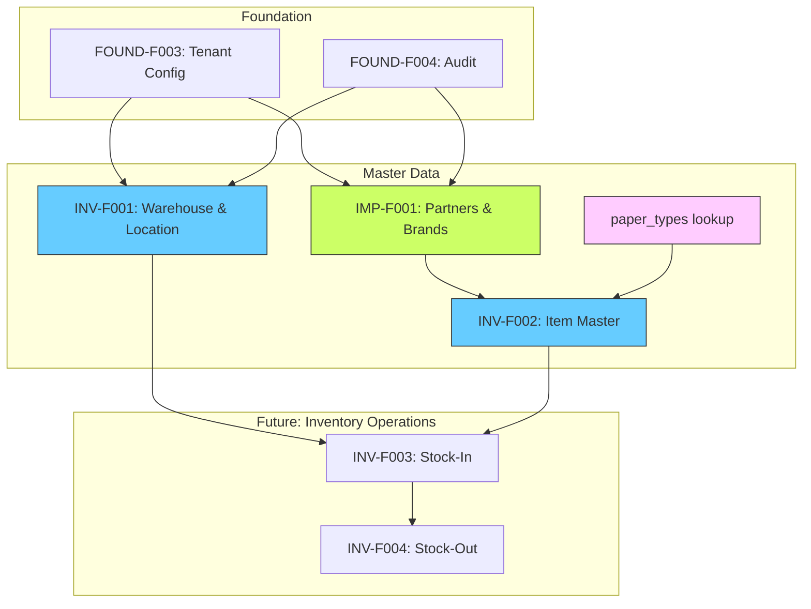

# Master Data Feature Set Specification

This document provides detailed specifications for the Master Data feature set (INV-F001, INV-F002, IMP-F001).
Master Data features are prerequisites for Inventory operations and Import/Production modules.

## Overview

### Feature List

| ID       | Name                            | Priority | Dependencies                     |
| -------- | ------------------------------- | -------- | -------------------------------- |
| INV-F001 | Warehouse & Location Management | P0       | FOUND-F003, FOUND-F004           |
| INV-F002 | Item Master Management          | P0       | FOUND-F003, FOUND-F004, IMP-F001 |
| IMP-F001 | Partner Management              | P0       | FOUND-F003, FOUND-F004           |

### Dependency Graph



### Data Model Overview

```
┌─────────────────┐
│  paper_types    │
│  (lookup)       │
└────────┬────────┘
         │ 1:N
         ▼
┌─────────────────┐      ┌─────────────────┐      ┌─────────────────┐
│     items       │◀─────│     brands      │◀─────│    partners     │
│                 │ N:1  │                 │ N:1  │                 │
│ - paper_type_id │      │ - partner_id    │      │ - type          │
│ - brand_id      │      │ - code (APRIL)  │      │ - country       │
│ - grammage      │      └─────────────────┘      └─────────────────┘
│ - width_mm      │
└────────┬────────┘
         │ 1:N (Future)
         ▼
┌─────────────────┐      ┌─────────────────┐      ┌─────────────────┐
│     stocks      │◀─────│   locations     │◀─────│   warehouses    │
│ - condition     │ N:1  │ - code          │ N:1  │ - code          │
│   (parent/      │      └─────────────────┘      └─────────────────┘
│    slitted)     │
└─────────────────┘
```

---

## INV-F001: Warehouse & Location Management

### Business Context

CHISAN Paper operates two warehouses:

- **Main Warehouse (HQ)**: Primary storage at company headquarters
- **External Warehouse**: Leased facility for overflow storage

Currently, inventory is tracked at the warehouse level without sub-locations. The schema supports future expansion to rack/shelf-level tracking.

### Database Schema

```sql
-- ============================================================================
-- Migration: 00005_create_warehouses.sql
-- ============================================================================

CREATE TABLE warehouses (
  id UUID PRIMARY KEY DEFAULT gen_random_uuid(),

  -- Identification
  code TEXT UNIQUE NOT NULL,           -- 'WH-MAIN', 'WH-EXT'
  name TEXT NOT NULL,                  -- '본사 창고'

  -- Address
  address TEXT,
  city TEXT,
  postal_code TEXT,

  -- Contact
  contact_name TEXT,
  contact_phone TEXT,

  -- Settings
  is_active BOOLEAN DEFAULT true NOT NULL,
  is_default BOOLEAN DEFAULT false NOT NULL,

  -- Metadata
  notes TEXT,
  created_at TIMESTAMPTZ DEFAULT NOW() NOT NULL,
  updated_at TIMESTAMPTZ DEFAULT NOW() NOT NULL
);

-- Indexes
CREATE INDEX idx_warehouses_code ON warehouses(code);
CREATE INDEX idx_warehouses_is_active ON warehouses(is_active);
CREATE UNIQUE INDEX idx_warehouses_single_default
  ON warehouses(is_default) WHERE is_default = true;

-- RLS
ALTER TABLE warehouses ENABLE ROW LEVEL SECURITY;

CREATE POLICY "warehouses_select_authenticated" ON warehouses
  FOR SELECT TO authenticated USING (true);

-- Trigger: updated_at
CREATE TRIGGER warehouses_updated_at
  BEFORE UPDATE ON warehouses
  FOR EACH ROW EXECUTE FUNCTION update_updated_at_column();
```

```sql
-- ============================================================================
-- Migration: 00006_create_locations.sql
-- ============================================================================

CREATE TYPE location_type AS ENUM ('default', 'zone', 'rack', 'shelf', 'floor');

CREATE TABLE locations (
  id UUID PRIMARY KEY DEFAULT gen_random_uuid(),
  warehouse_id UUID NOT NULL REFERENCES warehouses(id) ON DELETE CASCADE,

  -- Identification
  code TEXT NOT NULL,                  -- 'DEFAULT', 'A-01-02'
  name TEXT,
  type location_type DEFAULT 'default' NOT NULL,

  -- Hierarchy (future)
  parent_id UUID REFERENCES locations(id) ON DELETE SET NULL,

  -- Status
  is_active BOOLEAN DEFAULT true NOT NULL,

  -- Metadata
  notes TEXT,
  created_at TIMESTAMPTZ DEFAULT NOW() NOT NULL,
  updated_at TIMESTAMPTZ DEFAULT NOW() NOT NULL,

  UNIQUE(warehouse_id, code)
);

-- Indexes
CREATE INDEX idx_locations_warehouse ON locations(warehouse_id);
CREATE INDEX idx_locations_type ON locations(type);

-- RLS
ALTER TABLE locations ENABLE ROW LEVEL SECURITY;

CREATE POLICY "locations_select_authenticated" ON locations
  FOR SELECT TO authenticated USING (true);

-- Trigger: updated_at
CREATE TRIGGER locations_updated_at
  BEFORE UPDATE ON locations
  FOR EACH ROW EXECUTE FUNCTION update_updated_at_column();

-- Trigger: Auto-create default location
CREATE OR REPLACE FUNCTION create_default_location()
RETURNS TRIGGER LANGUAGE plpgsql SECURITY DEFINER AS $$
BEGIN
  INSERT INTO locations (warehouse_id, code, name, type)
  VALUES (NEW.id, 'DEFAULT', NEW.name || ' - 기본', 'default');
  RETURN NEW;
END;
$$;

CREATE TRIGGER warehouse_create_default_location
  AFTER INSERT ON warehouses
  FOR EACH ROW EXECUTE FUNCTION create_default_location();
```

### API Endpoints

| Method | Path                               | Description           | Role           |
| ------ | ---------------------------------- | --------------------- | -------------- |
| GET    | `/api/v1/warehouses`               | List warehouses       | All            |
| GET    | `/api/v1/warehouses/:id`           | Get warehouse details | All            |
| POST   | `/api/v1/warehouses`               | Create warehouse      | Admin, Manager |
| PATCH  | `/api/v1/warehouses/:id`           | Update warehouse      | Admin, Manager |
| DELETE | `/api/v1/warehouses/:id`           | Deactivate warehouse  | Admin          |
| GET    | `/api/v1/warehouses/:id/locations` | List locations        | All            |
| POST   | `/api/v1/warehouses/:id/locations` | Create location       | Admin, Manager |
| PATCH  | `/api/v1/locations/:id`            | Update location       | Admin, Manager |

### Business Rules

| ID      | Rule                 | Description                                 |
| ------- | -------------------- | ------------------------------------------- |
| WH-R01  | Unique code          | Warehouse code must be unique, uppercase    |
| WH-R02  | Single default       | Only one warehouse can be default           |
| WH-R03  | No delete with stock | Cannot delete warehouse with inventory      |
| LOC-R01 | Unique per warehouse | Location code unique within warehouse       |
| LOC-R02 | Auto default         | Default location auto-created per warehouse |

### Seed Data

```sql
-- Warehouses (locations auto-created via trigger)
INSERT INTO warehouses (code, name, address, city, is_default) VALUES
  ('WH-MAIN', '본사 창고', '경기도 광주시', '광주시', true),
  ('WH-EXT', '외부 임대 창고', '경기도 이천시', '이천시', false);
```

---

## IMP-F001: Partner Management

### Business Context

Partners include both **Suppliers** (domestic and overseas) and **Customers**. A supplier can have multiple brands (e.g., Asia Pulp & Paper has APP and APRIL brands).

### Database Schema

```sql
-- ============================================================================
-- Migration: 00008_create_partners.sql
-- ============================================================================

CREATE TYPE partner_type AS ENUM ('supplier', 'customer', 'both');

CREATE TABLE partners (
  id UUID PRIMARY KEY DEFAULT gen_random_uuid(),

  -- Identification
  partner_code TEXT UNIQUE NOT NULL,   -- 'SUP-001', 'CUS-001'
  name TEXT NOT NULL,
  name_local TEXT,                     -- Korean/Chinese name
  partner_type partner_type NOT NULL,

  -- Location
  country_code TEXT NOT NULL,          -- ISO 3166-1 alpha-2
  address TEXT,
  city TEXT,

  -- Contact
  contact_name TEXT,
  contact_email TEXT,
  contact_phone TEXT,

  -- Supplier-specific (nullable if customer only)
  supplier_currency TEXT,              -- 'USD', 'EUR', 'KRW'
  supplier_payment_terms TEXT,         -- 'T/T 30 days', 'L/C at sight'
  lead_time_days INTEGER,

  -- Customer-specific (nullable if supplier only)
  customer_currency TEXT,
  customer_payment_terms TEXT,
  credit_limit NUMERIC(15,2),

  -- Status
  is_active BOOLEAN DEFAULT true NOT NULL,

  -- Metadata
  notes TEXT,
  created_at TIMESTAMPTZ DEFAULT NOW() NOT NULL,
  updated_at TIMESTAMPTZ DEFAULT NOW() NOT NULL
);

-- Indexes
CREATE INDEX idx_partners_code ON partners(partner_code);
CREATE INDEX idx_partners_type ON partners(partner_type);
CREATE INDEX idx_partners_country ON partners(country_code);
CREATE INDEX idx_partners_name ON partners(name);

-- RLS
ALTER TABLE partners ENABLE ROW LEVEL SECURITY;

CREATE POLICY "partners_select_authenticated" ON partners
  FOR SELECT TO authenticated USING (true);

-- Trigger
CREATE TRIGGER partners_updated_at
  BEFORE UPDATE ON partners
  FOR EACH ROW EXECUTE FUNCTION update_updated_at_column();
```

```sql
-- ============================================================================
-- Migration: 00009_create_brands.sql
-- ============================================================================

CREATE TABLE brands (
  id UUID PRIMARY KEY DEFAULT gen_random_uuid(),
  partner_id UUID NOT NULL REFERENCES partners(id) ON DELETE CASCADE,

  -- Identification
  code TEXT UNIQUE NOT NULL,           -- 'APP', 'APRIL', 'BOHUI'
  name TEXT NOT NULL,
  description TEXT,

  -- Status
  is_active BOOLEAN DEFAULT true NOT NULL,

  -- Metadata
  created_at TIMESTAMPTZ DEFAULT NOW() NOT NULL,
  updated_at TIMESTAMPTZ DEFAULT NOW() NOT NULL
);

-- Indexes
CREATE INDEX idx_brands_partner ON brands(partner_id);
CREATE INDEX idx_brands_code ON brands(code);

-- RLS
ALTER TABLE brands ENABLE ROW LEVEL SECURITY;

CREATE POLICY "brands_select_authenticated" ON brands
  FOR SELECT TO authenticated USING (true);

-- Trigger
CREATE TRIGGER brands_updated_at
  BEFORE UPDATE ON brands
  FOR EACH ROW EXECUTE FUNCTION update_updated_at_column();
```

### API Endpoints

| Method | Path                          | Description                | Role           |
| ------ | ----------------------------- | -------------------------- | -------------- |
| GET    | `/api/v1/partners`            | List partners (filterable) | All            |
| GET    | `/api/v1/partners/:id`        | Get partner details        | All            |
| POST   | `/api/v1/partners`            | Create partner             | Admin, Manager |
| PATCH  | `/api/v1/partners/:id`        | Update partner             | Admin, Manager |
| DELETE | `/api/v1/partners/:id`        | Deactivate partner         | Admin          |
| GET    | `/api/v1/partners/suppliers`  | List suppliers only        | All            |
| GET    | `/api/v1/partners/customers`  | List customers only        | All            |
| GET    | `/api/v1/partners/:id/brands` | List partner's brands      | All            |
| POST   | `/api/v1/partners/:id/brands` | Create brand               | Admin, Manager |
| GET    | `/api/v1/brands`              | List all brands            | All            |
| PATCH  | `/api/v1/brands/:id`          | Update brand               | Admin, Manager |

### Business Rules

| ID      | Rule              | Description                              |
| ------- | ----------------- | ---------------------------------------- |
| PTN-R01 | Unique code       | Partner code format: SUP-XXX, CUS-XXX    |
| PTN-R02 | Valid country     | Country code must be ISO 3166-1 alpha-2  |
| PTN-R03 | Supplier currency | Supplier type requires supplier_currency |
| PTN-R04 | Customer currency | Customer type requires customer_currency |
| PTN-R05 | No hard delete    | Cannot delete partners with orders       |
| BRD-R01 | Unique code       | Brand code globally unique               |
| BRD-R02 | Supplier only     | Brands can only be linked to suppliers   |

### Seed Data

```sql
-- Partners (Suppliers)
INSERT INTO partners (partner_code, name, name_local, partner_type, country_code, supplier_currency, lead_time_days, notes) VALUES
  ('SUP-001', 'Asia Pulp & Paper', 'APP', 'supplier', 'ID', 'USD', 45, 'Indonesia - APP and APRIL brands'),
  ('SUP-002', 'Bohui Paper', '博汇纸业', 'supplier', 'CN', 'USD', 30, 'China'),
  ('SUP-003', 'Wuxing Paper', '五星纸业', 'supplier', 'CN', 'USD', 30, 'China'),
  ('SUP-004', 'Nippon Paper Industries', '日本製紙', 'supplier', 'JP', 'USD', 60, 'Japan - NPI'),
  ('SUP-005', 'Hokuetsu Kishu', '北越キシュ', 'supplier', 'JP', 'USD', 60, 'Japan - H-K');

-- Partners (Customers)
INSERT INTO partners (partner_code, name, partner_type, country_code, customer_currency, credit_limit) VALUES
  ('CUS-001', '삼성인쇄', 'customer', 'KR', 'KRW', 50000000),
  ('CUS-002', '대한포장', 'customer', 'KR', 'KRW', 30000000);

-- Brands (after partners exist)
INSERT INTO brands (partner_id, code, name) VALUES
  ((SELECT id FROM partners WHERE partner_code = 'SUP-001'), 'APP', 'Asia Pulp & Paper'),
  ((SELECT id FROM partners WHERE partner_code = 'SUP-001'), 'APRIL', 'APRIL'),
  ((SELECT id FROM partners WHERE partner_code = 'SUP-002'), 'BOHUI', 'Bohui'),
  ((SELECT id FROM partners WHERE partner_code = 'SUP-003'), 'WUXING', 'Wuxing'),
  ((SELECT id FROM partners WHERE partner_code = 'SUP-003'), 'ROXCEL', 'Roxcel'),
  ((SELECT id FROM partners WHERE partner_code = 'SUP-004'), 'NPI', 'Nippon Paper'),
  ((SELECT id FROM partners WHERE partner_code = 'SUP-005'), 'H-K', 'Hokuetsu Kishu');
```

---

## INV-F002: Item Master Management

### Business Context

Item Master defines paper product specifications. This is a **specification catalog**, not physical inventory. Physical stock (including condition: parent/slitted) is tracked in the `stocks` table (INV-F003).

Paper identification pattern from current Excel:

```
{PAPER_TYPE} [{BRAND}], {GRAMMAGE} G, {WIDTH} MM
Example: WOODFREE OFFSET [WUXING], 70 G, 1000 MM
```

### Database Schema

```sql
-- ============================================================================
-- Migration: 00007_create_paper_types.sql (Lookup Table)
-- ============================================================================

CREATE TABLE paper_types (
  id UUID PRIMARY KEY DEFAULT gen_random_uuid(),

  code TEXT UNIQUE NOT NULL,           -- 'WF', 'CP', 'OFF'
  name_en TEXT NOT NULL,               -- 'Woodfree Offset'
  name_ko TEXT,                        -- '백상지'
  description TEXT,

  sort_order INTEGER DEFAULT 0,
  is_active BOOLEAN DEFAULT true NOT NULL,

  created_at TIMESTAMPTZ DEFAULT NOW() NOT NULL
);

-- RLS
ALTER TABLE paper_types ENABLE ROW LEVEL SECURITY;

CREATE POLICY "paper_types_select_authenticated" ON paper_types
  FOR SELECT TO authenticated USING (true);

-- Seed Data
INSERT INTO paper_types (code, name_en, name_ko, sort_order) VALUES
  ('WF', 'Woodfree Offset', '백상지', 1),
  ('CP', 'Photocopy Paper', '복사용지', 2),
  ('OFF', 'Offset', '옵셋지', 3),
  ('ART', 'Art Paper', '아트지', 4),
  ('FB', 'Form Bond', '폼본드', 5),
  ('NW', 'Natural White', '내추럴화이트', 6),
  ('KR', 'Kraft', '크라프트지', 7),
  ('MG', 'MG Paper', 'MG지', 8),
  ('BK', 'Book Paper', '서적용지', 9),
  ('NCR', 'NCR Paper', 'NCR지', 10),
  ('FBB', 'Folding Box Board', 'FBB', 11),
  ('OTH', 'Other', '기타', 99);
```

```sql
-- ============================================================================
-- Migration: 00010_create_items.sql
-- ============================================================================

CREATE TABLE items (
  id UUID PRIMARY KEY DEFAULT gen_random_uuid(),

  -- Identification
  item_code TEXT UNIQUE NOT NULL,      -- Auto: 'WF-70-1000-R'
  display_name TEXT NOT NULL,          -- 'Woodfree Offset 70g 1000mm Roll'

  -- Classification
  paper_type_id UUID NOT NULL REFERENCES paper_types(id),
  brand_id UUID REFERENCES brands(id), -- Optional

  -- Specifications
  grammage INTEGER NOT NULL,           -- g/m² (30-500)
  width_mm INTEGER,                    -- mm (nullable for sheets)
  form TEXT NOT NULL CHECK (form IN ('roll', 'sheet')),

  -- Roll-specific
  core_diameter_inch NUMERIC(3,1),     -- 3.0, 6.0 inch

  -- Sheet-specific
  length_mm INTEGER,
  sheets_per_ream INTEGER DEFAULT 500,

  -- Inventory settings
  unit_of_measure TEXT DEFAULT 'kg' NOT NULL,

  -- Status
  is_active BOOLEAN DEFAULT true NOT NULL,

  -- Metadata
  notes TEXT,
  created_at TIMESTAMPTZ DEFAULT NOW() NOT NULL,
  updated_at TIMESTAMPTZ DEFAULT NOW() NOT NULL
);

-- Indexes
CREATE INDEX idx_items_code ON items(item_code);
CREATE INDEX idx_items_paper_type ON items(paper_type_id);
CREATE INDEX idx_items_brand ON items(brand_id);
CREATE INDEX idx_items_grammage ON items(grammage);
CREATE INDEX idx_items_form ON items(form);
CREATE INDEX idx_items_active ON items(is_active);

-- Composite for common search
CREATE INDEX idx_items_type_grammage_width
  ON items(paper_type_id, grammage, width_mm);

-- RLS
ALTER TABLE items ENABLE ROW LEVEL SECURITY;

CREATE POLICY "items_select_authenticated" ON items
  FOR SELECT TO authenticated USING (true);

-- Trigger
CREATE TRIGGER items_updated_at
  BEFORE UPDATE ON items
  FOR EACH ROW EXECUTE FUNCTION update_updated_at_column();

-- ============================================================================
-- Function: Auto-generate item_code
-- ============================================================================

CREATE OR REPLACE FUNCTION generate_item_code()
RETURNS TRIGGER LANGUAGE plpgsql AS $$
DECLARE
  type_code TEXT;
  form_code TEXT;
BEGIN
  -- Get paper type code
  SELECT code INTO type_code FROM paper_types WHERE id = NEW.paper_type_id;

  -- Determine form code
  form_code := CASE WHEN NEW.form = 'roll' THEN 'R' ELSE 'S' END;

  -- Generate code: WF-70-1000-R or WF-70-A4-S
  IF NEW.item_code IS NULL OR NEW.item_code = '' THEN
    IF NEW.form = 'roll' THEN
      NEW.item_code := type_code || '-' || NEW.grammage || '-' || NEW.width_mm || '-' || form_code;
    ELSE
      NEW.item_code := type_code || '-' || NEW.grammage || '-' || NEW.width_mm || 'x' || NEW.length_mm || '-' || form_code;
    END IF;
  END IF;

  RETURN NEW;
END;
$$;

CREATE TRIGGER items_generate_code
  BEFORE INSERT ON items
  FOR EACH ROW EXECUTE FUNCTION generate_item_code();
```

### API Endpoints

| Method | Path                      | Description             | Role           |
| ------ | ------------------------- | ----------------------- | -------------- |
| GET    | `/api/v1/paper-types`     | List paper types        | All            |
| POST   | `/api/v1/paper-types`     | Create paper type       | Admin          |
| PATCH  | `/api/v1/paper-types/:id` | Update paper type       | Admin          |
| GET    | `/api/v1/items`           | List items (filterable) | All            |
| GET    | `/api/v1/items/:id`       | Get item details        | All            |
| POST   | `/api/v1/items`           | Create item             | Admin, Manager |
| PATCH  | `/api/v1/items/:id`       | Update item             | Admin, Manager |
| DELETE | `/api/v1/items/:id`       | Deactivate item         | Admin          |
| GET    | `/api/v1/items/search`    | Search by specs         | All            |

#### Query Parameters for Items

| Parameter       | Type    | Description          |
| --------------- | ------- | -------------------- |
| `paper_type_id` | UUID    | Filter by paper type |
| `brand_id`      | UUID    | Filter by brand      |
| `grammage`      | number  | Exact grammage       |
| `grammage_min`  | number  | Minimum grammage     |
| `grammage_max`  | number  | Maximum grammage     |
| `width_mm`      | number  | Exact width          |
| `form`          | string  | 'roll' or 'sheet'    |
| `is_active`     | boolean | Active status        |
| `q`             | string  | Search display_name  |

### Business Rules

| ID      | Rule                      | Description                                                                  |
| ------- | ------------------------- | ---------------------------------------------------------------------------- |
| ITM-R01 | Auto code                 | item_code auto-generated if not provided                                     |
| ITM-R02 | Grammage range            | Grammage must be 30-500 g/m²                                                 |
| ITM-R03 | Width range               | Width must be 50-2500 mm for rolls                                           |
| ITM-R04 | Roll requires width       | Roll form must have width_mm                                                 |
| ITM-R05 | Sheet requires dimensions | Sheet form must have width_mm and length_mm                                  |
| ITM-R06 | No hard delete            | Cannot delete items with stock history                                       |
| ITM-R07 | Unique spec               | Combination of paper_type + brand + grammage + width + form should be unique |

### Seed Data

```sql
-- Sample Items (after paper_types and brands exist)
INSERT INTO items (display_name, paper_type_id, brand_id, grammage, width_mm, form, core_diameter_inch) VALUES
  ('Woodfree Offset [WUXING] 70g 1000mm',
   (SELECT id FROM paper_types WHERE code = 'WF'),
   (SELECT id FROM brands WHERE code = 'WUXING'),
   70, 1000, 'roll', 3.0),

  ('Offset IK Bluish White [APP] 70g 1580mm',
   (SELECT id FROM paper_types WHERE code = 'OFF'),
   (SELECT id FROM brands WHERE code = 'APP'),
   70, 1580, 'roll', 3.0),

  ('Natural White [APRIL] 90g 1700mm',
   (SELECT id FROM paper_types WHERE code = 'NW'),
   (SELECT id FROM brands WHERE code = 'APRIL'),
   90, 1700, 'roll', 3.0),

  ('Form Bond [NPI] 80g 1700mm',
   (SELECT id FROM paper_types WHERE code = 'FB'),
   (SELECT id FROM brands WHERE code = 'NPI'),
   80, 1700, 'roll', 3.0),

  ('Photocopy Paper [BOHUI] 75g 210mm',
   (SELECT id FROM paper_types WHERE code = 'CP'),
   (SELECT id FROM brands WHERE code = 'BOHUI'),
   75, 210, 'roll', 3.0);
```

---

## Migration Order

```
supabase/migrations/
├── 00001_create_users.sql           ✅ Exists
├── 00002_create_user_roles.sql      ✅ Exists
├── 00003_create_audit_logs.sql      ✅ Exists
├── 00004_create_settings.sql        ✅ Exists
├── 00005_create_warehouses.sql      🆕 INV-F001
├── 00006_create_locations.sql       🆕 INV-F001
├── 00007_create_paper_types.sql     🆕 INV-F002 (lookup, no deps)
├── 00008_create_partners.sql        🆕 IMP-F001
├── 00009_create_brands.sql          🆕 IMP-F001 (depends: partners)
├── 00010_create_items.sql           🆕 INV-F002 (depends: paper_types, brands)
└── seed.sql                         🆕 Development data
```

---

## Implementation Order

1. **Week 1: Infrastructure**
   - INV-F001: Warehouses & Locations
   - IMP-F001: Partners & Brands
   - paper_types lookup table

2. **Week 1-2: Item Master**
   - INV-F002: Items table
   - Item code auto-generation
   - Search/filter APIs

3. **Week 2: Integration**
   - Seed data for development
   - API integration tests
   - Data preprocessing script for Excel import

---

## Definition of Done

Master Data is complete when:

- [ ] Warehouses CRUD with auto-created default locations
- [ ] Partners CRUD with supplier/customer type filtering
- [ ] Brands linked to supplier partners
- [ ] Paper types lookup table populated
- [ ] Items CRUD with auto-generated codes
- [ ] Items searchable by paper_type, brand, grammage, width
- [ ] All tables have RLS policies
- [ ] Seed data loads successfully
- [ ] APIs return proper validation errors
