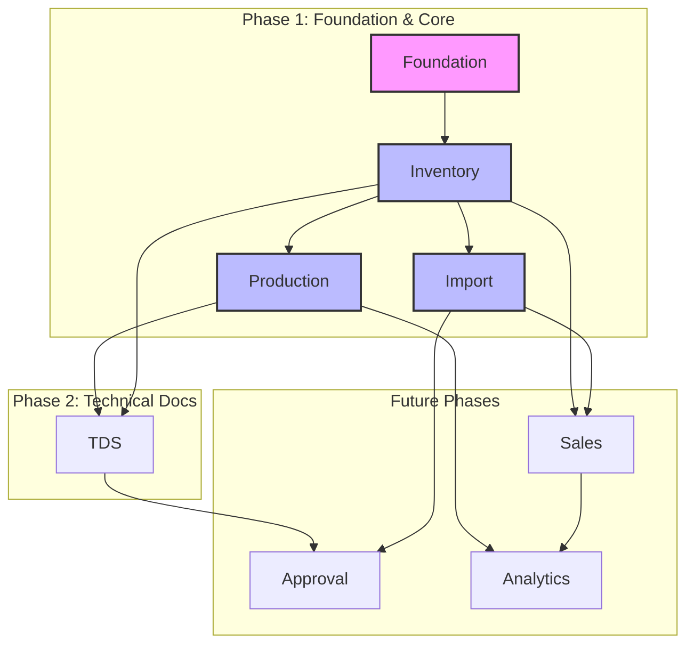

# Feature Map Overview (EvoDev)

This document explains the **EvoDev (Evolutionary Development)** methodology applied to the development of the CHISAN Paper platform and its key tool, the **Feature Map**.

## 1. Introduction to EvoDev Methodology

### Background of Feature-Driven Development

Modern software development faces complex business logic and frequent requirement changes. EvoDev is a methodology proposed to flexibly respond to these changes while incrementally building sophisticatedly designed software centered on business value.

### Concept and Benefits of Feature Map (DAG)

The core of EvoDev is the **Feature Map**. It models dependencies between features as a **Directed Acyclic Graph (DAG)**.

- **Visibility**: Provides an at-a-glance view of the functional terrain of the entire system.
- **Stable Development Sequence**: Guarantees stability of lower layers and incrementally expands functions through development in dependency order (Topology Order).
- **Impact Analysis**: Allows immediate identification of the impact of changes or failures in specific features on upper-level features.

### Multi-layer Context

In EvoDev, each Feature is defined not as a simple functional unit, but as a complex with contexts of three layers.

1. **Business Layer**: Defines business workflows, rules, and user value
2. **Design Layer**: Designs UI/UX flow, component structure, and interactions
3. **Implementation Layer**: Defines data models, API endpoints, and actual code implementation

---

## 2. Overall Structure of CHISAN Platform Feature Map

The CHISAN Platform is developed in multiple Phases considering business importance and dependency relationships.

### Overall Feature Sets Overview

### Feature Set Classification by Phase

- **Phase 1 (CORE)**: Implements basic functions of Inventory, Import, and Production to build a Minimum Viable Product (MVP) capable of practical business operation.
- **Phase 2**: Adds quality and technical information management functions such as Technical Data Sheet (TDS) management.
- **Future**: Expands to Approval workflow, Sales management, Business Intelligence (Analytics), etc.

---

## 3. Feature Specification Schema

All Features are defined according to the following standardized schema.

| Item                  | Description                                                                                   |
| :-------------------- | :-------------------------------------------------------------------------------------------- |
| **Business Workflow** | The position and step-by-step flow of the function within the business process                |
| **Business Rules**    | Domain constraints and logic that must be observed when performing the function               |
| **UI Flow**           | The path and interaction through which users perform functions on the screen                  |
| **Data Flow**         | The flow of creating, retrieving, updating, and deleting data according to function execution |
| **Components**        | Major UI components and data models required for implementation                               |

---

## 4. Development Process

Development according to the EvoDev methodology follows this iterative cycle.

1. **Prioritization based on DAG**: Start development from Root Features with no dependencies.
2. **Context Definition**: Finalize Business, Design, and Implementation specifications for the Feature.
3. **Iterative Development**: Implement and test functions based on the defined context.
4. **Context Propagation**: Utilize interfaces (API, Type, etc.) of implemented functions for developing upper dependent functions.

---

## 5. Feature ID Convention

All Features are assigned a unique ID for traceability.

- **Naming Convention**: `{MODULE}-F{NUMBER}-{SHORT_NAME}`
- **Components**:
  - `MODULE`: Module abbreviation (INV, IMP, PROD, TDS, FOUND, etc.)
  - `NUMBER`: Three-digit serial number
  - `SHORT_NAME`: English abbreviation of the function (SNAKE_CASE)

**Example:**

- `INV-F001-WAREHOUSE_MGMT`: Warehouse management function of Inventory module
- `FOUND-F001-AUTH`: Authentication function of Foundation system
