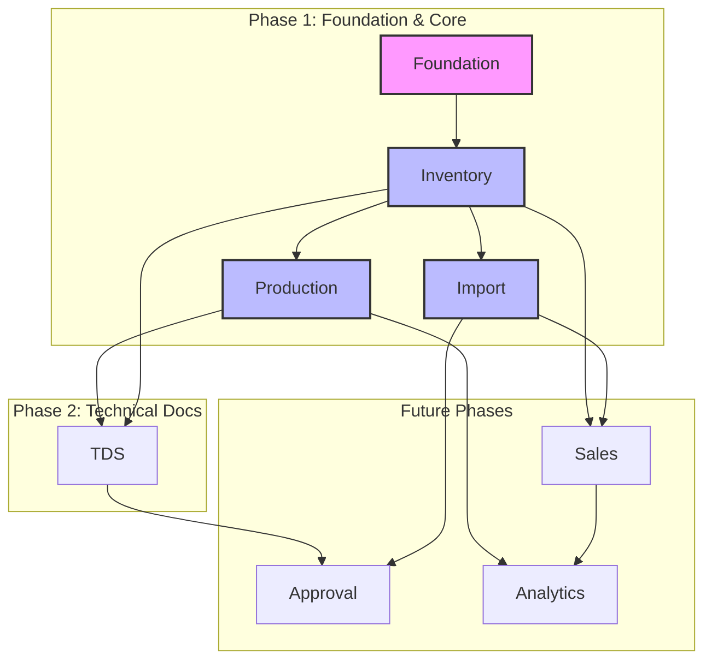

# Feature Map Overview (EvoDev)

이 문서는 지산페이퍼(CHISAN Paper) 플랫폼 개발에 적용된 **EvoDev(Evolutionary Development)** 방법론과 그 핵심 도구인 **Feature Map**에 대해 설명합니다.

## 1. EvoDev 방법론 소개

### Feature-Driven Development의 배경
현대적인 소프트웨어 개발은 복잡한 비즈니스 로직과 빈번한 요구사항 변화에 직면해 있습니다. EvoDev는 이러한 변화에 유연하게 대응하면서도, 비즈니스 가치를 중심으로 정교하게 설계된 소프트웨어를 점진적으로 구축하기 위해 제안된 방법론입니다.

### Feature Map (DAG)의 개념과 장점
EvoDev의 핵심은 **Feature Map**입니다. 이는 기능(Feature) 간의 의존성을 **방향성 비순환 그래프(Directed Acyclic Graph, DAG)** 형태로 모델링한 것입니다.
- **가시성**: 전체 시스템의 기능적 지형을 한눈에 파악할 수 있습니다.
- **안정적인 개발 순서**: 의존성 순서(Topology Order)에 따른 개발을 통해 하위 계층의 안정성을 보장하며 점진적으로 기능을 확장합니다.
- **영향도 분석**: 특정 기능의 변경이나 장애가 상위 기능에 미치는 영향을 즉각적으로 파악할 수 있습니다.

### Multi-layer Context
EvoDev에서는 각 Feature를 단순한 기능 단위가 아닌, 세 가지 레이어의 컨텍스트를 가진 복합체로 정의합니다.
1. **Business Layer**: 비즈니스 워크플로우, 규칙, 사용자 가치 정의
2. **Design Layer**: UI/UX 흐름, 컴포넌트 구조, 인터랙션 설계
3. **Implementation Layer**: 데이터 모델, API 엔드포인트, 실제 코드 구현

---

## 2. CHISAN Platform의 Feature Map 전체 구조

CHISAN Platform은 비즈니스 중요도와 의존 관계를 고려하여 여러 Phase로 나뉘어 개발됩니다.

### 전체 Feature Sets 개요

### Phase별 Feature Set 분류
- **Phase 1 (CORE)**: 재고(Inventory), 수입(Import), 생산(Production)의 기본 기능을 구현하여 실질적인 비즈니스 운영이 가능한 최소 단위(MVP)를 구축합니다.
- **Phase 2**: 기술 데이터 시트(TDS) 관리 등 품질 및 기술 정보 관리 기능을 추가합니다.
- **Future**: 승인 워크플로우(Approval), 판매 관리(Sales), 비즈니스 인텔리전스(Analytics) 등으로 확장합니다.

---

## 3. Feature Specification Schema

모든 Feature는 다음의 표준화된 스키마에 따라 정의됩니다.

| 항목 | 설명 |
| :--- | :--- |
| **Business Workflow** | 해당 기능이 비즈니스 프로세스 내에서 차지하는 위치와 단계별 흐름 |
| **Business Rules** | 기능 수행 시 준수해야 하는 도메인 제약 조건 및 로직 |
| **UI Flow** | 사용자가 화면에서 기능을 수행하는 경로 및 인터랙션 |
| **Data Flow** | 기능 수행에 따른 데이터의 생성, 조회, 수정, 삭제 흐름 |
| **Components** | 구현에 필요한 주요 UI 컴포넌트 및 데이터 모델 |

---

## 4. 개발 프로세스

EvoDev 방법론에 따른 개발은 다음의 반복 사이클을 따릅니다.

1. **DAG 기반 우선순위 선정**: 의존성이 없는 Root Feature부터 개발을 시작합니다.
2. **Context 정의**: 해당 Feature의 Business, Design, Implementation 명세를 확정합니다.
3. **Iterative Development**: 정의된 컨텍스트를 기반으로 기능을 구현하고 테스트합니다.
4. **Context 전파**: 구현된 기능의 인터페이스(API, Type 등)를 상위 의존 기능 개발에 활용합니다.

---

## 5. Feature ID 규칙

모든 Feature는 추적 가능성을 위해 고유한 ID를 부여받습니다.

- **명명 규칙**: `{MODULE}-F{NUMBER}-{SHORT_NAME}`
- **구성 요소**:
    - `MODULE`: 모듈 약어 (INV, IMP, PROD, TDS, FOUND 등)
    - `NUMBER`: 세 자리 일련번호
    - `SHORT_NAME`: 기능의 영문 약칭 (SNAKE_CASE)

**예시:**
- `INV-F001-WAREHOUSE_MGMT`: 재고 모듈의 창고 관리 기능
- `FOUND-F001-AUTH`: 기반 시스템의 인증 기능
