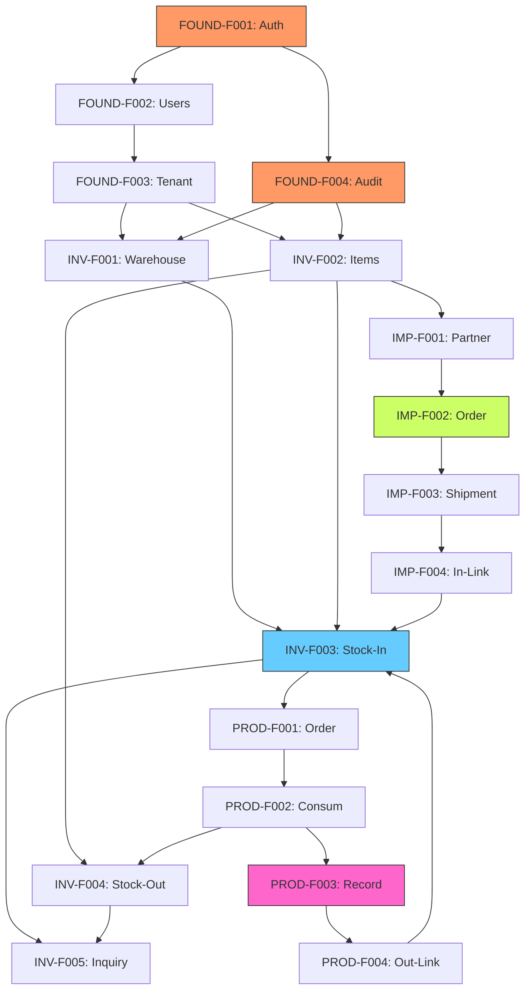

# Phase 1: Foundation & Core Feature Map

Phase 1 aims to establish key infrastructure for stable operation of the CHISAN Paper platform and foundation functions for the 3 core business modules (Inventory, Import, Production).

## 1. Phase 1 Goals

- **Foundation Establishment**: Secure common infrastructure for security and user management
- **Inventory Core**: Secure real-time inventory visibility and establish location-based management system
- **Import Foundation**: Digitalization of overseas order and shipment tracking processes
- **Production Core**: Implementation of slitting process performance recording and Raw Material-Finished Goods traceability (Lineage)

---

## 2. Feature Set 0: Foundation

This Feature Set provides Root dependencies for all system functions to operate.

> **Detailed Specification**: Check [Foundation Specification](./foundation-spec.md) for details on role definitions, permission matrix, audit log policies, etc.

### FOUND-F001: Authentication (Google OAuth)

- **Business Workflow**: Internal employees securely access the system with existing Google Workspace accounts.
- **UI Flow**: Login Page -> Select Google Account -> Create Session -> Main Dashboard.
- **Data Flow**: Receive OAuth Provider Response -> Check/Create User Table -> Issue JWT Session.
- **Constraints**: Only `@chisanpaper.com` domain emails allowed.

### FOUND-F002: User Management

- **Business Workflow**: System admin assigns roles to users and controls access rights.
- **UI Flow**: Admin Settings -> User List -> Assign Role (Admin, Worker, Manager).
- **Data Flow**: `users` and `user_roles` table CRUD.
- **Roles**: `admin` (Full Access), `manager` (Operation Access), `worker` (Field Access).

### FOUND-F003: Tenant Configuration

- **Business Workflow**: Manage basic company info, currency units, and system environment settings.
- **UI Flow**: System Settings -> Enter Company Info -> Set Environment Variables.
- **Data Flow**: Manage `settings` table singleton.
- **Categories**: Company Info, Regional, Inventory, Notifications.

### FOUND-F004: Audit Logging

- **Business Workflow**: Automatically record critical system changes to ensure traceability and compliance.
- **UI Flow**: Admin Settings -> Audit Log -> Search/Filter -> View Detail/Export.
- **Data Flow**: Auto-record to `audit_logs` table in all write APIs.
- **Scope**: Auth events, role changes, inventory changes, state transitions, financial data changes.

---

## 3. Feature Set 1: Inventory

The central axis managing the flow of 'Paper', the core of the business.

### INV-F001: Warehouse & Location Management

- **Business Workflow**: Define physical warehouses and specific storage locations (Rack, Zone) within them.
- **UI Flow**: Warehouse Management Screen -> Register Warehouse -> Set Location Grid.
- **Data Flow**: `warehouses` -> `locations` (1:N) data model composition.

### INV-F002: Item Master Management

- **Business Workflow**: Standardize and manage paper specifications (grammage, width, type).
- **UI Flow**: Item Master -> Register Item (Enter Specs) -> Link Barcode Template.
- **Data Flow**: Save physical attributes (grammage, width, etc.) in `items` table.

### INV-F003: Stock-In Processing

- **Business Workflow**: Load externally received or produced products into specific locations.
- **UI Flow**: Stock-In Schedule List -> Select Location -> Scan Barcode -> Confirm Stock-In.
- **Data Flow**: Create `stocks` and record `stock_movements` (TYPE: IN).

### INV-F004: Stock-Out Processing

- **Business Workflow**: Dispatch inventory for sales shipment or production input.
- **UI Flow**: Stock-Out Request List -> Select Inventory (FIFO recommended) -> Scan -> Confirm Stock-Out.
- **Data Flow**: Decrease `stocks` and record `stock_movements` (TYPE: OUT).

### INV-F005: Stock Inquiry

- **Business Workflow**: Identify real-time inventory quantity by warehouse and item.
- **UI Flow**: Inventory Dashboard -> Filter (Item, Warehouse) -> Check Detail List/Total.
- **Data Flow**: Join query of `stocks`, `items`, `locations`.

---

## 4. Feature Set 2: Import

### IMP-F001: Partner Management

- **Business Workflow**: Manage overseas supplier information.
- **UI Flow**: Partner Management -> Register Supplier (Contact, Currency, Lead Time).
- **Data Flow**: Manage `partners` table.

### IMP-F002: Order Management

- **Business Workflow**: Create import Purchase Order (PO) and track status.
- **UI Flow**: Write Order -> Select Item -> Enter Unit Price -> Create PO.
- **Data Flow**: Save `import_orders` and `import_order_items`.

### IMP-F003: Shipment Tracking

- **Business Workflow**: Monitor shipment progress (ETD, ETA) by B/L unit.
- **UI Flow**: Shipment List -> Update Transport Info -> View Schedule Calendar.
- **Data Flow**: Record `shipments` status changes.

### IMP-F004: Stock-In Integration

- **Business Workflow**: Switch customs-cleared shipments to stock-in pending status.
- **UI Flow**: Click Customs Complete Button -> Link to INV-F003 (Stock-In Processing) screen.
- **Data Flow**: `shipments` status propagates as source data for INV-F003.

---

## 5. Feature Set 3: Production

### PROD-F001: Production Order

- **Business Workflow**: Plan slitting work and issue work orders.
- **UI Flow**: Create Production Order -> Enter Target Quantity/Specs -> Print Order.
- **Data Flow**: Create `production_orders` table.

### PROD-F002: Material Consumption

- **Business Workflow**: Deduct Parent Rolls used in production from inventory.
- **UI Flow**: Start Work -> Scan Input Parent Roll Barcode -> Link INV-F004.
- **Data Flow**: Record `production_inputs` and request `stocks` deduction.

### PROD-F003: Slitting Job Recording

- **Business Workflow**: Record specs and weight of actual rolls produced at the work site.
- **UI Flow**: Enter Job Result -> Issue Product Roll Barcode -> Enter Weight.
- **Data Flow**: Record `slitting_jobs` and job details.

### PROD-F004: Product Output

- **Business Workflow**: Register produced slitting rolls as finished goods inventory.
- **UI Flow**: Complete Production Report -> Auto-trigger INV-F003 (Stock-In Processing).
- **Data Flow**: Increase `stocks` based on `production_outputs` info.

---

## 6. Phase 1 Full Feature Map DAG

### Development Order (Topology Order)

1. **Foundation**: FOUND-F001, F002, F003, F004
2. **Master Data**: INV-F001, INV-F002, IMP-F001
3. **Core Inventory**: INV-F003, INV-F004, INV-F005
4. **Import Flow**: IMP-F002, IMP-F003, IMP-F004
5. **Production Flow**: PROD-F001, PROD-F002, PROD-F003, PROD-F004

---

## 7. Milestones and Checkpoints

### Week 1-2: Infra & Master Data

- [ ] Google OAuth Login Integration Complete (FOUND-F001)
- [ ] User Role Management Implementation (FOUND-F002)
- [ ] Audit Log Infrastructure Setup (FOUND-F004)
- [ ] System Settings Implementation (FOUND-F003)
- [ ] Warehouse and Item Master CRUD Implementation
- [ ] Database Basic Schema Application

### Week 3-4: Inventory MVP

- [ ] Stock-In/Out Barcode Scan Processing Logic Complete
- [ ] Real-time Inventory Dashboard Development
- [ ] Inventory Movement History (Movement Log) Verification

### Week 5-6: Import & Production Integration

- [ ] Order-Shipment-Stock-In Integration Pipeline Completion
- [ ] Production Order-Input-Output Stock-In Process Completion
- [ ] Raw Material vs Finished Goods Tracking Function Check

### MVP Criteria (Checkpoint)

- Are barcodes attached to all Roll unit products and locations tracked in the system?
- Is the process of imported parent rolls being converted into slitting rolls through the production process continuously connected as data?
- Are access rights properly controlled according to user roles?
- Are all critical changes (Inventory, State Transition) recorded in the audit log?
