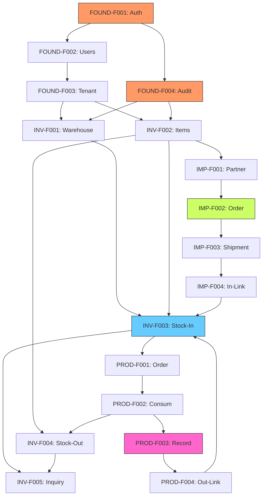

# Phase 1: Foundation & Core Feature Map

Phase 1은 지산페이퍼 플랫폼의 안정적인 운영을 위한 핵심 인프라와 3대 핵심 비즈니스 모듈(재고, 수입, 생산)의 기반 기능을 구축하는 것을 목표로 합니다.

## 1. Phase 1 목표
- **Foundation 구축**: 보안 및 사용자 관리를 위한 공통 인프라 확보
- **Inventory Core**: 실시간 재고 가시성 확보 및 위치 기반 관리 체계 수립
- **Import Foundation**: 해외 발주 및 선적 추적 프로세스의 디지털화
- **Production Core**: 슬리팅 공정의 실적 기록 및 원재료-완제품 이력 추적(Lineage) 구현

---

## 2. Feature Set 0: Foundation (공통 기반)

이 Feature Set은 시스템의 모든 기능이 동작하기 위한 루트(Root) 의존성을 제공합니다.

> **상세 명세**: [Foundation Specification](./foundation-spec.md) 문서에서 역할 정의, 권한 매트릭스, 감사 로그 정책 등 상세 내용을 확인하세요.

### FOUND-F001: Authentication (Google OAuth)
- **Business Workflow**: 사내 직원들이 기존 Google 워크스페이스 계정으로 시스템에 안전하게 접속합니다.
- **UI Flow**: 로그인 페이지 -> Google 계정 선택 -> 세션 생성 -> 메인 대시보드.
- **Data Flow**: OAuth Provider 응답 수신 -> 사용자 테이블 확인/생성 -> JWT 세션 발행.
- **Constraints**: `@chisanpaper.com` 도메인 이메일만 허용.

### FOUND-F002: User Management
- **Business Workflow**: 시스템 관리자가 사용자별 역할을 부여하고 접속 권한을 제어합니다.
- **UI Flow**: 관리자 설정 -> 사용자 목록 -> 역할(Admin, Worker, Manager) 할당.
- **Data Flow**: `users` 및 `user_roles` 테이블 CRUD.
- **Roles**: `admin` (전체 권한), `manager` (운영 권한), `worker` (실무 권한).

### FOUND-F003: Tenant Configuration
- **Business Workflow**: 회사 기본 정보, 통화 단위, 시스템 환경 설정을 관리합니다.
- **UI Flow**: 시스템 설정 -> 회사 정보 입력 -> 환경 변수 설정.
- **Data Flow**: `settings` 테이블 싱글톤 관리.
- **Categories**: Company Info, Regional, Inventory, Notifications.

### FOUND-F004: Audit Logging
- **Business Workflow**: 시스템의 중요 변경사항을 자동으로 기록하여 추적성과 규정 준수를 보장합니다.
- **UI Flow**: 관리자 설정 -> 감사 로그 -> 검색/필터링 -> 상세 보기/내보내기.
- **Data Flow**: 모든 쓰기 API에서 `audit_logs` 테이블에 자동 기록.
- **Scope**: 인증 이벤트, 역할 변경, 재고 변동, 상태 전이, 재무 데이터 변경.

---

## 3. Feature Set 1: Inventory (재고관리)

비즈니스의 핵심인 '종이'의 흐름을 관리하는 중심축입니다.

### INV-F001: Warehouse & Location Management
- **Business Workflow**: 물리적 창고와 그 내부의 구체적인 보관 위치(Rack, Zone)를 정의합니다.
- **UI Flow**: 창고 관리 화면 -> 창고 등록 -> 로케이션 그리드 설정.
- **Data Flow**: `warehouses` -> `locations` (1:N) 데이터 모델 구성.

### INV-F002: Item Master Management
- **Business Workflow**: 종이의 규격(평량, 지폭, 종류)을 표준화하여 관리합니다.
- **UI Flow**: 품목 마스터 -> 품목 등록(규격 입력) -> 바코드 템플릿 연결.
- **Data Flow**: `items` 테이블에 물리적 속성(grammage, width 등) 저장.

### INV-F003: Stock-In Processing
- **Business Workflow**: 외부 입고 또는 생산 완료된 제품을 특정 위치에 적재합니다.
- **UI Flow**: 입고 예정 리스트 -> 위치 선택 -> 바코드 스캔 -> 입고 확정.
- **Data Flow**: `stocks` 생성 및 `stock_movements` (TYPE: IN) 기록.

### INV-F004: Stock-Out Processing
- **Business Workflow**: 판매 출고 또는 생산 투입을 위해 재고를 불출합니다.
- **UI Flow**: 출고 요청 목록 -> 재고 선택(FIFO 권장) -> 스캔 -> 출고 확정.
- **Data Flow**: `stocks` 감소 및 `stock_movements` (TYPE: OUT) 기록.

### INV-F005: Stock Inquiry
- **Business Workflow**: 창고별, 품목별 실시간 재고량을 파악합니다.
- **UI Flow**: 재고 현황판 -> 필터링(품목, 창고) -> 상세 리스트/합계 확인.
- **Data Flow**: `stocks` 및 `items`, `locations` 조인 쿼리.

---

## 4. Feature Set 2: Import (수입관리)

### IMP-F001: Partner Management
- **Business Workflow**: 해외 공급사 정보를 관리합니다.
- **UI Flow**: 거래처 관리 -> 공급사 등록(연락처, 통화, 리드타임).
- **Data Flow**: `partners` 테이블 관리.

### IMP-F002: Order Management
- **Business Workflow**: 수입 발주서(PO)를 생성하고 상태를 추적합니다.
- **UI Flow**: 발주 작성 -> 품목 선택 -> 단가 입력 -> PO 생성.
- **Data Flow**: `import_orders` 및 `import_order_items` 저장.

### IMP-F003: Shipment Tracking
- **Business Workflow**: B/L 단위의 선적 진행 상황(ETD, ETA)을 모니터링합니다.
- **UI Flow**: 선적 목록 -> 운송 정보 업데이트 -> 일정 달력 보기.
- **Data Flow**: `shipments` 상태 변화 기록.

### IMP-F004: Stock-In Integration
- **Business Workflow**: 통관 완료된 선적 화물을 재고 입고 대기로 전환합니다.
- **UI Flow**: 통관 완료 버튼 클릭 -> INV-F003(입고 처리) 화면으로 연동.
- **Data Flow**: `shipments` 상태가 INV-F003의 소스 데이터로 전파.

---

## 5. Feature Set 3: Production (생산관리)

### PROD-F001: Production Order
- **Business Workflow**: 슬리팅 작업을 계획하고 작업 지시서를 발행합니다.
- **UI Flow**: 생산 지시 생성 -> 목표 수량/사양 입력 -> 지시서 출력.
- **Data Flow**: `production_orders` 테이블 생성.

### PROD-F002: Material Consumption
- **Business Workflow**: 생산에 투입된 원지(Parent Roll)를 재고에서 차감합니다.
- **UI Flow**: 작업 시작 -> 투입 원지 바코드 스캔 -> INV-F004 연동.
- **Data Flow**: `production_inputs` 기록 및 `stocks` 차감 요청.

### PROD-F003: Slitting Job Recording
- **Business Workflow**: 작업 현장에서 실제 생산된 롤들의 사양과 중량을 기록합니다.
- **UI Flow**: 작업 결과 입력 -> 생산 롤 바코드 발행 -> 중량 입력.
- **Data Flow**: `slitting_jobs` 및 작업 상세 기록.

### PROD-F004: Product Output
- **Business Workflow**: 생산 완료된 슬리팅 롤을 완제품 재고로 등록합니다.
- **UI Flow**: 생산 보고 완료 -> INV-F003(입고 처리) 자동 트리거.
- **Data Flow**: `production_outputs` 정보를 기반으로 `stocks` 증가.

---

## 6. Phase 1 전체 Feature Map DAG

### 개발 순서 (Topology Order)
1. **Foundation**: FOUND-F001, F002, F003, F004
2. **Master Data**: INV-F001, INV-F002, IMP-F001
3. **Core Inventory**: INV-F003, INV-F004, INV-F005
4. **Import Flow**: IMP-F002, IMP-F003, IMP-F004
5. **Production Flow**: PROD-F001, PROD-F002, PROD-F003, PROD-F004

---

## 7. 마일스톤 및 체크포인트

### Week 1-2: Infra & Master Data
- [ ] Google OAuth 로그인 연동 완료 (FOUND-F001)
- [ ] 사용자 역할 관리 구현 (FOUND-F002)
- [ ] 감사 로그 인프라 구축 (FOUND-F004)
- [ ] 시스템 설정 구현 (FOUND-F003)
- [ ] 창고 및 품목 마스터 CRUD 구현
- [ ] 데이터베이스 기본 스키마 적용

### Week 3-4: Inventory MVP
- [ ] 입고/출고 바코드 스캔 처리 로직 완료
- [ ] 실시간 재고 조회 현황판 개발
- [ ] 재고 이동 이력(Movement Log) 검증

### Week 5-6: Import & Production Integration
- [ ] 발주-선적-입고 연동 파이프라인 완성
- [ ] 생산 지시-투입-결과물 입고 프로세스 완성
- [ ] 원재료 대비 완제품 추적 기능 확인

### MVP 기준 (Checkpoint)
- 모든 롤(Roll) 단위 제품에 바코드가 부착되고 시스템에서 위치가 추적되는가?
- 수입된 원지가 생산 공정을 거쳐 슬리팅 롤로 변환되는 과정이 데이터로 끊김 없이 이어지는가?
- 사용자의 역할에 따라 접근 권한이 적절히 통제되는가?
- 모든 중요 변경사항(재고, 상태 전이)이 감사 로그에 기록되는가?
